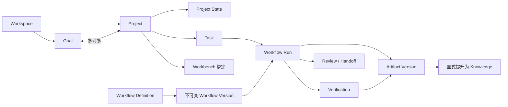
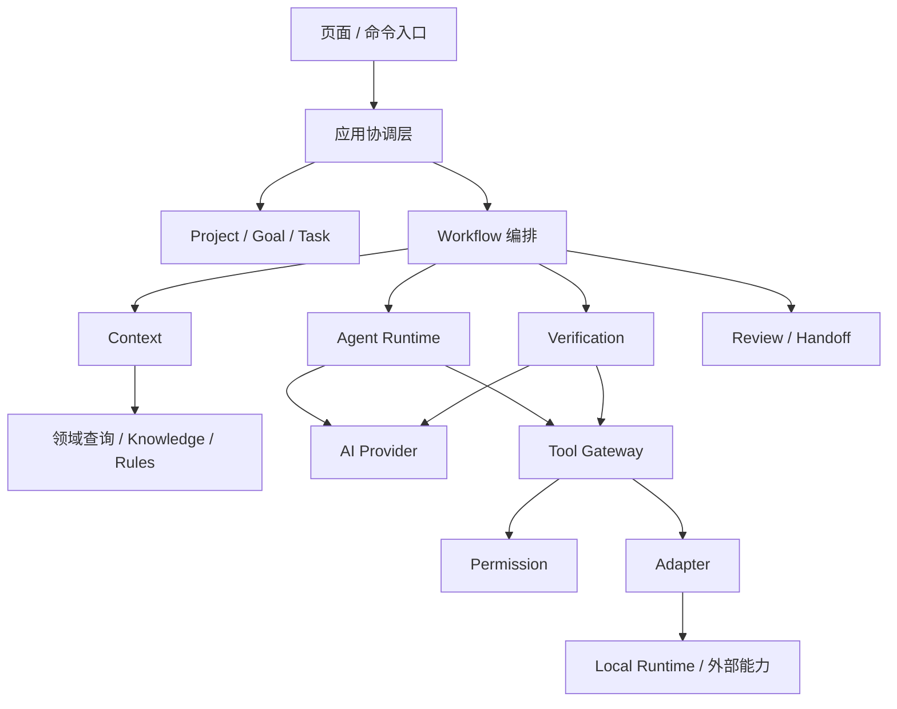
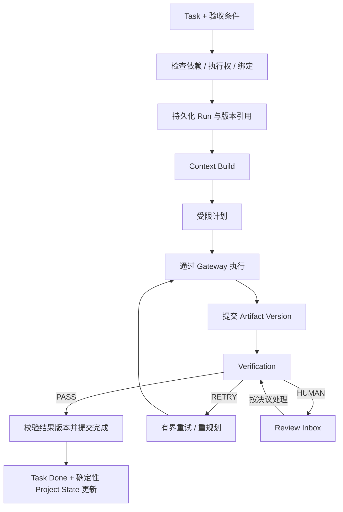
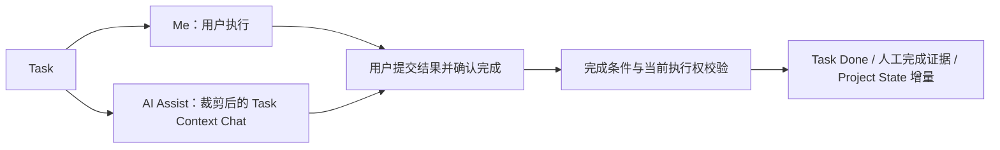

# Personal Workflow OS：V1 架构设计草案

角色：历史架构草案。原始状态：Draft。日期：2026-09-18；历史边界整理：2026-09-19。

本文正文只保留早期设计，不再逐段同步当前选型；此前混入的 TypeScript 推荐移回[技术选型](technology-selection.md)。当前架构主入口为[领域模型](domain-model.md)，业务语义以[四份契约](../../contracts/README.md)为准；与本文的差异见[设计审计](../development/design-audit.md)。以下 Java/Spring、模块归属、状态映射与停止条件均是历史假设，不能作为当前实施指令或已接受 ADR。

依据：[产品总纲](../../Personal_Workflow_OS_Master_Spec.md)、[本阶段任务](../../CODEX_NEXT_STEP.md)。本文提出实现边界，不替代产品事实源，不代表已有代码或已接受的技术决策。数据库、API、前端组件树及工程骨架不在本轮范围。

设计目标：让一个 Task 能由人完成、由 AI 辅助完成，或委托 AI 执行；委托执行可中断恢复、产物可验证、人工决策可追溯，最终更新真实 Project State。

当时假设：单用户、单 Personal Workspace；Java / Spring Boot 模块化单体；V1 以单机运行闭环为起点，Local Runtime 暂与后端同机。远程服务器访问用户电脑的配对与通信方案未冻结，不作为既成事实。

## 1. Domain Model

### 1.1 建模尺度

Aggregate 是一致性与修改权限边界，不等于数据库表，也不要求每个概念独立模块。跨聚合使用标识引用；Project 不加载所有 Task、Artifact 或历史 Run。只在确有生命周期与约束时引入实体。

| 概念 | 职责与关系 | 建模候选 | V1 边界 |
|---|---|---|---|
| Workspace | Goal、Project、资料、权限及连接的归属边界 | 聚合根 | 一个 Personal Workspace，所有资源验证归属 |
| Goal | 期望达成的结果；同 Workspace 内与 Project 多对多 | 聚合根 | 基础目标与关联，不做独立一级导航 |
| Project | 持续工作身份、类型、生命周期及当前状态 | 聚合根 | 不作为无限扩大的对象容器 |
| Project State | 阶段、完成事实、阻塞、风险、下一步、关键引用 | Project 内值对象快照，带修订号 | 区分人工事实、确定性事实、未接受建议 |
| Milestone | Project 的轻量阶段目标 | Project 内实体 | 手动维护；不引入复杂里程碑引擎 |
| Task | What / Why / Input / Expected Result / Acceptance Criteria、模式、依赖、结果 | 聚合根 | 三种执行模式与七种产品状态 |
| Workbench | 页面及工作能力的组合描述 | 内置定义值对象；Project 保存绑定 | 三种内置工作台，不做插件市场 |
| Workflow Definition | 某类执行方法的稳定身份 | 聚合根 | 内置顺序模板 |
| Workflow Version | 发布后不可变的步骤与验证策略 | Definition 内版本实体 | Run 固定引用某一版本 |
| Workflow Run | 一次执行的状态、步骤进度、尝试、等待与恢复位置 | 聚合根 | 可恢复执行的唯一权威记录 |
| Artifact | 实际结果及不可变版本引用 | 聚合根，版本为内部实体 | 文档、报告、代码变更等引用与版本 |
| Artifact Lineage | 来源、父版本、Task、Run、模型及验证关联 | 版本内来源值对象 | 基础来源链，不做图谱系统 |
| Verification | 针对确切产物版本和验收条件的判断与证据 | Run 下的不可变记录实体 | PASS / RETRY / HUMAN；由验证模块写入 |
| Knowledge | 可检索资料及来源；可绑定 Project | 聚合根 | File、Web Link、Note、Validated Artifact |
| Memory | 经确认且值得跨 Session 保留的信息 | 聚合根候选，归 Knowledge 模块管理 | 基础人工确认、失效与替换；不自动学习偏好 |
| Decision | 有效决定、理由、备选方案与替代关系 | 聚合根，归 Project 模块管理 | ACTIVE / SUPERSEDED；独立于 Memory |
| Rule | 指定作用域内的约束或可覆盖偏好 | 聚合根候选 | 基础分层，不做通用策略语言 |
| Handoff | 将可继续工作的状态交给新执行者 | 聚合根候选 | 交接包与接受记录；不建立多 Agent 调度 |
| Review Item | 针对一个确定对象版本的人工判断请求 | 聚合根 | 挂起、接受、拒绝、修改、稍后处理 |
| Activity / Trace | 用户时间线与执行证据 | 追加记录 | 按 Project / Task / Run 查询；不保存私有 CoT |
| Capability | 与供应方无关的能力及输入输出语义 | 注册描述值对象 | READ_FILE、RUN_TEST 等有限集合 |
| Tool | 某个能力的具体实现与风险元数据 | 注册实体 / 描述候选 | 不等同于权限；连接单独承载可用性 |
| Permission | 主体对指定动作、资源和范围的授权规则 | 策略值对象与授权记录 | AUTO / ASK / DENY |

补充执行概念仅服务上述闭环：Run 内 Step Attempt 记录每步尝试，Context Snapshot 记录本次输入证据，Tool Invocation 记录工具动作及结果。它们不成为新的产品功能。

### 1.2 关系与不变量



- Inbox Task 可暂未绑定 Project；委托前必须绑定 Project，并补齐可执行目标及验收条件。Task 指定的 Goal 必须属于同 Workspace，并与其 Project 关联。
- 一个 Task 可有多个历史 Run，但同一时刻只允许一个活动执行者。PAUSED、WAITING_APPROVAL 仍占用活动执行权，不能通过重复点击再开一个 Run。
- Task 依赖限定同 Workspace，V1 建议限定同 Project；禁止自依赖和环。依赖未满足不能自动开始，取消前置 Task 不等于依赖成功。
- Workflow Version、提交的 Artifact Version、Verification 记录不可原地改写。修改结果创建新版本，旧 PASS 不自动继承。
- Worker 只能提交结果。只有完成协调逻辑可根据有效 Verification 将委托 Task 置为 Done。
- 人工 Me / AI Assist 的完成依据是用户提交结果并确认，记录为人工完成，不伪造自动 Verification PASS。
- Project State 使用修订检查；AI 只提交建议差异，不能直接覆盖整份状态。已完成某 Task 不推导整个阶段或 Goal 已完成。
- Memory 中 DECISION 类型只引用 Decision，不维护第二份可冲突的决定。Artifact 提升为 Knowledge 是显式动作。

## 2. System Module Architecture

### 2.1 部署与组织

当时推荐一个 Spring Boot 应用、一个一致性存储边界和同机后台执行器。持久化状态与外部工具动作分开处理；不在调用模型或运行命令期间保持数据库事务。当时具体数据库与队列产品尚未选择。

下面是逻辑边界，不意味着 19 个服务或构建工程。建议按工作管理、执行、资料、治理及适配组织包，先避免框架级插件化。

| 模块 | 拥有的职责 | 依赖与调用方式 |
|---|---|---|
| Project | Project、State、Milestone、Decision | 同步校验 Goal 关联；对外提供查询和状态变更命令 |
| Goal | Outcome、基础优先级及关联校验 | 不依赖 Run 或 Agent |
| Task | Task 生命周期、模式、依赖、完成事实 | 同步验证 Project / Goal 归属；不调用模型 |
| Today | Focus、可执行 Task、运行与提醒摘要 | 查询 Project / Goal / Task / Workflow；V1 现查即可 |
| Workbench | 类型解析、内置路由及绑定描述 | 提供配置，禁止执行过程中反向修改业务事实 |
| Workflow | 定义、版本、Run 状态机、恢复与完成协调 | 调用 Context、Runtime、Verification、Review、Task、Project |
| Agent Runtime | 按单步目标调用模型并提出工具请求 | 调用 AI Provider、Tool Gateway；只返回提交结果 |
| Context | 按任务裁剪和装配上下文 | 读取领域查询、Rules、Knowledge；不修改来源事实 |
| Verification | Hard / Rule / Semantic 检查与证据 | 读取产物；测试经 Gateway，语义判断经 Provider |
| Artifact | 产物登记、不可变版本、Lineage、可用性 | 不决定 Task 完成，不因文件存在就表示通过 |
| Knowledge | 资料、基础 Memory、检索与显式提升 | 可读取 Artifact 的已验证版本 |
| Review | 人工事项及一次性决议 | 接受协调层命令，返回决议；不直接驱动工具 |
| Activity / Trace | 时间线、运行证据、敏感信息脱敏 | 接收记录；不反向决定业务状态 |
| Rules | 分层规则与适用性解析 | 提供约束结果；不自行授予工具权限 |
| Handoff | 交接包、接收与执行权转移条件 | 读取 Task / Run / State；由协调层提交转移 |
| Tool Gateway | 能力解析、参数校验、权限门禁、调用记录 | 调用 Permission 与 Adapter，禁止 Agent 绕过 |
| Permission | 作用域校验与 AUTO / ASK / DENY 决策 | 读取策略、当前授权；不依赖 Agent 判断风险 |
| Local Runtime | Files、Git、受限进程执行 | 被 Local / CLI Adapter 调用；落实路径与执行边界 |
| AI Provider | 模型请求、结构化输出、错误归一化 | 不知道 Task 如何完成；V1 单配置 Provider |

### 2.2 依赖方向



Review 回答与 Handoff 接受由入口交给应用协调层处理，Review 模块本身不依赖 Workflow，避免双向调用环。Runtime 不读取 Workflow 内部存储，只接受带 Run / Step 标识的执行请求并返回结果。

### 2.3 同步、一致性与事件

- 同步调用用于权限判定、Task 依赖检查、Run 创建、审批消费、完成提交及 Project State 的确定性更新。
- Project 模块是 Project State 的唯一写入口，Task 模块是 Task 的唯一写入口，Workflow 模块是 Run 的唯一写入口。协调层调用这些模块的命令，不直接修改它们的存储。State 增量带来源、基线修订与唯一变更标识，重复恢复不得二次应用。
- 同一次本地短事务提交 Run 完成、Task Done、确定性 State 增量和关键审计记录。状态修订冲突时重读并重新验证增量，不覆盖人工更新。
- 长任务由后台执行器领取持久化 Run 继续执行。领取需要互斥及失效接管标记，旧执行器的迟到提交必须拒绝。
- Activity 展示、检索索引等派生信息可使用提交后 Domain Event；接收方按事件标识去重。允许延迟，但必须能从权威记录重建或补偿。
- 不依靠易丢失的内存事件启动或恢复关键步骤。V1 可直接扫描待执行记录，不引入独立消息总线，也不实施全量 Event Sourcing。

Today / Next Action 在 V1 采用可解释的确定性筛选：先检查任务就绪与依赖，再结合人工优先级、截止时间及当前 Project State 展示候选；用户可选择与延后。不建立自动时间排程或 Replanning 引擎。

## 3. Core Data Flow

### 3.1 Delegate AI



创建 Run 时冻结 Workflow Version、Task 输入及验收条件修订；保存 Context 的来源版本。若执行期间 Task 验收条件变化，原结果不能直接满足新要求，先暂停并重新核对。

PASS 后只更新可证明的事实，例如“Task X 已完成，结果为 Artifact v2”。“项目进入新阶段”等推断另建 Review Item，不能藏在确定性更新中。

### 3.2 Me 与 AI Assist



AI Assist 不隐式创建委托 Run。聊天建议不等于已执行，工具动作仍经 Gateway。若转 Delegate AI，通过显式模式切换创建 Run；存在活动 Run 时先完成暂停和交接，不能直接点 Done 越过执行中的副作用。

### 3.3 Handoff

```text
请求交接 → 停止领取新步骤 → 等待或核对正在执行的动作
→ 保存安全检查点 → 生成交接包 → 新执行者接受
→ 转移执行权 → 校验最新状态 / 权限 → 继续
```

交接包包含 Objective、Current State、Completed Work、Decisions、Constraints、Relevant Artifacts、Verification Status、Open Problems、Next Action、Owner，并引用确切版本与生成时间。

V1 首先落地 Human ↔ Agent；Agent A ↔ Agent B 保留包格式，不构建路由器。Workbench 切换只是展示适配，不自动转移所有权；Today → Tomorrow 可延续同一任务与检查点，无需创建新执行者。

委托转人工时，原 Run 在完成副作用核对后以交接原因结束为 CANCELLED，保留产物和证据；人工后续完成记录属于 Task。人工再委托创建关联前序交接包的新 Run。单纯暂停后由原执行者恢复则沿用原 Run。

### 3.4 Review

```text
系统产生确定的待判断事项 → 持久化 Review Item 与等待位置
→ 用户 Accept / Reject / Modify / Later
→ 核对 Run、对象版本、作用域与事项有效性
→ 一次性消费决议 → 按事项类型继续
```

| 类型 | Accept | Reject | Modify / Later |
|---|---|---|---|
| 工具授权 | 对原动作重新检查权限后执行 | 不执行；按模板转人工或失败 | 修改参数生成新请求；Later 保持等待 |
| Verification HUMAN | 记录人工验收证据，重新汇总判定 | 按反馈重做或结束失败 | 新产物需重新验证；Later 不推进 |
| Project State 建议 | 基于最新修订应用可接受差异 | 丢弃建议 | 修改后作为人工更新；Later 不影响已完成 Run |
| 重复失败 | 按用户选择重试或交接 | 结束本次 Run | 新计划重新校验；Later 等待 |

Review Item 不一律阻塞 Run；只有执行所必需的判断进入 WAITING_APPROVAL。Reject 不是统一的 Cancel，Accept 也不是统一的 PASS。

## 4. Workbench Architecture

### 4.1 解析与路由

Project Type 决定项目工作台；Task Type 决定任务专属视图。建议解析顺序为合法的显式绑定 → 对应 Type 的内置映射 → General。Task 层覆盖只影响任务视图，不替换整个 Project 导航。

Route Registry 保存稳定 route key、内置页面标识、可见条件与绑定。Core Routes 固定为 Overview、Tasks、Knowledge、Artifacts、Activity；Dynamic Routes 在 V1 仅指根据内置工作台选择显示的注册页面，不代表用户可创建任意路由。

| 工作台 | 注入页面 | V1 实现边界 |
|---|---|---|
| General | 无额外页面 | 基础任务、资料、产物与活动 |
| Research / Thesis | Research、Sources、Notes、Synthesis、Writing、Experiments、References | 已有资料、笔记、产物及运行记录的专门视图；不自建文献管理器或排版软件 |
| Development | Requirements、Development、Changes、Build、Tests、Verification、Release | 需求资料、代码变更、工具结果及验证报告；不内嵌 IDE 或自建 CI 平台 |

Release 页面可以展示发布材料和已有结果，不因页面存在就新增自动部署功能。Experiments 先展示任务、实验材料与结果，不引入专用实验平台。

### 4.2 三类绑定

- Workflow Binding：任务类型对应允许的模板与版本；已开始的 Run 不跟随配置升级。
- Capability Binding：声明页面动作和模板所需能力；声明不是授权，实际调用仍受 Gateway 限制。
- Rule Binding：叠加适用的工作规范，不放宽全局安全策略。

切换工作台不改变 Task 执行模式、不自动触发工具，也不变更历史 Run 的版本绑定。

### 4.3 Page Schema 与 Block Registry

V1 只保留“内置页面由受信任描述组合”的设计边界，不交付通用 Schema 编辑器。V1.5 才引入可持久化的 Page Schema、白名单 Block Registry 及配置变更审批。

未来 Schema 只能引用已注册 Block、数据查询和动作标识；不得包含任意 JavaScript、SQL、模板执行或任意网络地址。必须检查 Schema 版本、块数量、资源归属及动作权限。V1 不提前实现这套通用机制。

## 5. Agent Runtime State Machine

### 5.1 状态的所有者

Workflow Run 持有下列状态；Agent Runtime 只执行步骤。每次迁移校验预期状态、Run 修订、当前执行权和有效输入，拒绝迟到或重复回调。

| 状态 | 进入条件 / 工作 | 正常退出 |
|---|---|---|
| CREATED | Run 已持久化、版本和执行权已绑定 | 被领取后 CONTEXT_BUILDING |
| CONTEXT_BUILDING | 校验来源、装配并保存上下文快照 | 成功到 PLANNING；缺少必需输入到 PAUSED |
| PLANNING | 在固定模板与能力范围内形成步骤参数 | 合法到 RUNNING；需要人判断到 WAITING_APPROVAL |
| RUNNING | 执行当前步骤，先登记动作意图再调用工具 | 提交完整产物到 VERIFYING；待批准到 WAITING_APPROVAL |
| WAITING_APPROVAL | 已保存 Review Item 与明确续接位置 | 有效决议后回到对应步骤、VERIFYING 或 RETRYING |
| VERIFYING | 验证确切产物版本及验收条件 | PASS 后完成提交到 COMPLETED；RETRY 到 RETRYING；HUMAN 到 WAITING_APPROVAL |
| RETRYING | 已确定重试类别、次数、反馈与目标步骤 | 原步骤 / VERIFYING / CONTEXT_BUILDING；需重规划到 PLANNING |
| PAUSED | 保存续接位置，停止领取新步骤 | 前置条件满足后恢复保存的位置，必要时重建 Context |
| COMPLETED | 有效 PASS 与 Task / State 完成提交均成功 | 终态；新工作创建新 Run |
| FAILED | 不可恢复错误或重试耗尽且决定停止 | 终态；手动再试创建关联原 Run 的新 Run |
| CANCELLED | 停止请求已落实，动作结果已核对 | 终态；不隐含撤销已完成副作用 |

非终态可因不可恢复错误进入 FAILED；可在安全边界进入 PAUSED 或 CANCELLED。取消请求本身不是“外部动作已停止”的证据。

### 5.2 恢复与副作用

Run 检查点至少包含当前步骤、尝试号、版本引用、Context 引用、已提交产物、动作结果、待处理 Review 与恢复位置。这是 V1 Durability 的必要记录；不包含 V1.5 的项目历史浏览、比较、还原。

执行顺序为：持久化调用意图 → 调用工具 → 持久化结果 → 推进步骤。若工具成功后进程崩溃，结果可能 UNKNOWN：先查外部回执或检查目标状态，无法确认则转人工核对，不能自动重放写操作。V1 不承诺外部世界 exactly-once。

暂停与取消采用协作式停止。长命令支持安全终止时尝试停止；否则显示请求处理中并等待结果核对。旧执行器失去执行权后不得继续提交，恢复者也不能在旧动作是否执行未知时重复写入。

连接失效表示为 PAUSED + WAITING_CONNECTION 原因，在 Run Detail 展示“等待连接”。Reconnect 后重新检查权限；Skip 只适用于模板允许跳过且不影响验收的步骤；Fallback 遵守第 7 节。

WAITING_APPROVAL 的等待原因区分 PERMISSION、VERIFICATION_HUMAN、HUMAN_TOOL、REPEATED_FAILURE；人工步骤完成需附结果证据再继续，不能把“接受请求”当作工作已完成。PAUSED 另记录 USER_PAUSE、MISSING_INPUT 或 WAITING_CONNECTION，与需要提交决议的等待区分。

### 5.3 重试与验证约束

| 类别 | 行为 | 防止失控 |
|---|---|---|
| Transient Failure | 确认无未知副作用后重试原动作 | 有界次数与退避，不盲重试写入 |
| Execution Failure | 带失败证据修正当前步骤 | 创建新尝试，保留失败输出 |
| Reasoning Failure | 回到 PLANNING | 限制重规划次数，不扩大权限和任务目标 |
| Repeated Failure | 请求人工、交接或 FAILED | V1 不自动换 Agent / Provider |

建议起始默认值为每步骤最多自动重试 2 次、每 Run 最多重规划 1 次，并设置调用超时与有限步骤数；具体数值待实验调整。这些是运行终止保护，不提前实现完整成本 / Token Budget 管理产品。

Hard Check 必须通过；适用的 Rule Check 必须有证据；Semantic Judge 可判 HUMAN，不能覆盖构建失败、缺少文件等硬失败。人工确认只解决允许人工判断的验收项，不能把硬失败直接改成 PASS。若用户改变验收标准，应生成新修订并重新验证。

Verifier 与 Worker 可使用同一 Provider，但必须使用独立上下文和职责，不能接受 Worker 自报成功作为证据。无可用检查器、证据不足或规则冲突时进入 HUMAN。

### 5.4 Task 与 Run 的映射

| Run 情况 | Task 显示 |
|---|---|
| CREATED / CONTEXT_BUILDING / PLANNING / RUNNING / VERIFYING / RETRYING | In Progress |
| WAITING_APPROVAL、用户暂停、等待连接 | Waiting，并展示具体原因 |
| FAILED 或依赖无法满足 | Blocked，并展示恢复入口 |
| COMPLETED | Done |
| CANCELLED | 用户取消任务则 Cancelled；仅取消执行则 Ready；交接人工则 In Progress |

以上由同一协调逻辑更新，不让页面自行推断和写回。Inbox / Ready 由任务信息完整性、人工安排和依赖决定。

## 6. Context Architecture

### 6.1 装配流程

```text
确定 Workspace / Project / Task 作用域
→ 读取当前事实与修订 → 解析适用规则与有效 Decision
→ 筛选资料 → 去重、排序、预算裁剪
→ 保存 Context Snapshot 与来源清单 → 提交本次模型调用
```

Context 是一次调用或步骤使用的装配结果，不是另一份长期状态库。运行期间工具返回值作为本步骤证据加入；每次后续调用仍需裁剪，不能无限累加聊天。

| 优先层 | 来源 | 裁剪规则 |
|---|---|---|
| 必需 | 系统策略、Applicable Rules、Task 目标与验收、关联 Goal、当前 Project State | 保留当前任务相关的完整约束；过大则缩小任务或暂停，不能静默删规则 |
| 高相关 | ACTIVE Decision、依赖、Validated Memory | 按适用范围与当前任务相关性筛选；有效关键决定不能因较旧而忽略 |
| 按需 | Knowledge、历史 Artifact、相关 Activity | 先精确引用和项目过滤，再全文检索；V1 不强制向量检索 |
| 最低 | 必要 Raw Conversation 片段 | 默认不加入全量历史，只引用可定位片段；摘要仍不是事实 |

### 6.2 优先级的两种含义

事实优先级遵循总纲：Live Project State > Explicit Decision > Validated Memory > Knowledge > Raw Conversation。若 State 与 Decision 对同一事实冲突，以当前 State 描述现状，同时记录冲突，不能据此自动废弃 Decision；涉及下一步动作合法性时暂停判断。

规则是行为约束，不能用事实优先级覆盖。Global → Workspace → Project → Workbench → Task 中，可覆盖的偏好由更具体范围决定；禁止项和资源边界只能收紧。无法同时满足的强约束进入 Review，不交给模型自行挑选。

SUPERSEDED Decision 不作为有效指令注入，只在需要历史解释时提供。检索到的网页、文件和工具输出均是资料，不具有修改系统策略或授权的地位。

### 6.3 Budget 与版本变化

可用输入预算 = 模型上下文容量 − 输出预留 − 工具定义开销 − 安全余量。具体容量从 Provider 配置获得，不在设计中假定某模型常量。先放必需项，再按相关性放资料；保存遗漏原因，截断需标记。

初始 Context 固定作为证据。审批恢复、交接恢复或关键副作用执行前，重新检查 Task 验收修订、Project State、Decision 和权限。变化影响执行时形成新快照或重新规划；不静默替换历史快照，也不因追求可重现而继续使用已撤销权限。

V1 Run Detail 显示来源标识、修订、选择理由、工具结果及验证证据；完整可交互 Context Inspector 留到 V1.5。敏感凭据不注入模型或明文 Trace；对来源保存最小必要快照 / 摘要及校验信息，保留期限待确认。

## 7. Tool Gateway 与 Permission Model

### 7.1 调用链

```text
Workflow 所需 Capability
→ 作用域内 Tool Registry 候选
→ 校验参数和实际风险
→ Permission：AUTO / ASK / DENY
→ 记录调用意图 → Adapter → 结果核对与 Trace
```

Runtime 只能看到当前 Task 所需且可能被允许的工具；注册表可见性不是授权，Gateway 每次执行仍检查。未知 Capability、越界资源、不可判定的命令不按低风险自动放行。

| 抽象 | 含义 |
|---|---|
| Capability | 稳定能力语义、输入输出要求，如 RUN_TEST |
| Tool | 实现此能力的操作及 Provider / Connection 引用 |
| Adapter | Native、REST、MCP、CLI、Local、Human 的调用转换 |
| Risk | 本次具体动作的影响等级，不能只依赖工具名称 |
| Side Effect | 无、受限本地写入、外部变化、破坏性变化等 |
| Reversibility | 是否能恢复、如何恢复、恢复条件；不代表必然自动回滚 |
| Scope | 允许的 Workspace、Project、文件根、仓库、目标资源及动作 |
| Permission | 指定主体和作用域下对本次动作的授权结果 |
| Fallback | 同等能力及效果约束下的备用实现，仍须重新授权 |

### 7.2 Adapter 落地范围

| Adapter | V1 | 后续 |
|---|---|---|
| Native | 内部确定性操作 | 按需增加，仍遵守领域写入边界 |
| Local | Files、同机资源检查 | 独立本地代理待部署需求确定 |
| CLI | 受限 Git、测试与命令执行 | 逐步支持外部 Coding Agent CLI |
| REST / SDK | Web 所需有限连接器；Provider 由独立模块管理 | 按真实任务扩展，非通用任意 URL 代理 |
| Human | 人工步骤、结果提交与继续 | 保持为标准兜底 |
| MCP | 仅保留 Adapter 边界 | V1.5 再实现 Client，不要求 V1 可调用 |

Browser 留作长期最后兜底，V1 不实现万能浏览器自动化。接口兼容不等于六类 Adapter 都必须提前实现。

### 7.3 授权与实际边界

| 动作 | V1 默认 | 条件 |
|---|---|---|
| 已授权范围内读取 | AUTO | 资源归属、敏感数据与读取范围仍需校验 |
| 低风险可逆写入 | AUTO | 限定项目目录，已知效果，具有恢复手段 |
| 对外发送、推送等高影响动作 | ASK | 审批绑定确切目标、参数与内容版本 |
| 删除、覆盖、危险命令 | ASK / DENY | 不满足边界或无法安全限定时 DENY |

Task Autonomy 只决定委托程度，不授予更多 Tool Permission。用户对任务的委托不能让运行时跳过产品总纲要求的高风险审批。

审批授权绑定 Run、Step、动作摘要、目标、参数 / 内容摘要、权限修订和有效期，并只能消费一次。任何影响效果的变化使旧批准失效；执行前再次检查，防止“批准 A，实际执行 B”。

文件访问解析真实路径，防止相对路径穿越、符号链接或 Windows junction 越界；写入新文件校验已存在父路径。进程 working directory 不是隔离边界：V1 仅对明确允许的可执行程序与参数开放自动调用，无法限制副作用的任意 Shell 不进入 AUTO。

运行测试也可能执行项目脚本、访问网络或修改文件，不能把 RUN_TEST 固定当只读。Git push 属于外部动作。Web 请求限制协议、目的地址和重定向，禁止借网页抓取访问未授权本地或内部资源。凭据由连接层使用，不交给模型。

### 7.4 Fallback 与不确定结果

只读失败可在相同作用域下切备用 Provider。写入只有确认尚未执行，或有跨尝试可核验的幂等保障，才允许重试 / Fallback。超时但执行结果未知时转核对或 Human，禁止换 Provider 再写一次。

V1 使用固定优先顺序和可用性判断，不实现成本 / 可靠性智能路由。没有可用 Provider 时暂停并给出 Reconnect、合规 Fallback 或 Human 入口，不伪造成功。

## 8. V1 风险审计与讨论入口

### 8.1 范围风险

| 风险 | V1 处理 | 保留的核心价值 |
|---|---|---|
| 领域概念多，被实现成大量服务 / 表 | 逻辑模块化；不从术语数量推导部署和表数量 | 可理解边界与一致性 |
| Today 退化为 Todo 或扩展成排程系统 | 展示 Goal / State / 依赖支持的 Next Action；人工可选与延后 | 当前推进决策 |
| Workbench 变成 Notion / 低代码平台 | 三种内置页面组合，复用资料与结果 | 工作形态适配 |
| Development 变成 Codex / IDE | 连接受限执行能力，保存变更与验证证据 | 可交接、可验证的工作状态 |
| Research 变成论文套件 | 资料、来源、结果和任务视图，不做全文编辑平台 | 来源与产物可追溯 |
| Durable Run 变成通用工作流引擎 | 固定顺序、有限分支、检查点与人工等待 | 中断后安全继续 |
| Semantic Judge 被当作真值 | 硬检查优先，证据不足交给人 | 不由 Worker 自证完成 |
| Gateway 变成连接器商城 | Files / Git / Terminal / Web + Human | 有边界的真实执行 |
| Memory 变成自动画像系统 | 确认后保存、可失效、可替代 | 防止旧信息污染上下文 |

不建议删除总纲中的 V1 核心概念；应压缩实现深度。优先不做独立 Local Agent 服务、MCP 实现、向量库、Schema 编辑器、自动偏好学习、复杂事件总线和可视化 Workflow Builder。仅保留真正需要的边界，不为空想的扩展写通用框架。

### 8.2 产品文档中的待确认点

1. Command Bar 在总纲第 42 节包含 Start Focus，但完整 Focus Mode 被第 14 节列为后续。建议 V1 不提供完整 Focus 会话，是否保留“打开当前任务”式入口需确认。
2. Handoff 列举 Agent A → Agent B，但多 Agent Router 明确后置。建议 V1 验收 Human ↔ Agent 与工作上下文延续；不包含自动 Agent 选择。
3. 同机部署是本草案假设；若 V1 必须云端后端连接个人电脑，需要另行设计 Local Runtime 认证、配对与断线语义，影响较大。
4. Task 依赖是否允许跨 Project 尚无明确规定；草案建议先限定同 Project，批准前不将此视为冻结需求。
5. 论文研究切口仍未冻结；现有验证记录与 Context 来源证据可支持后续实验，不提前增加实验平台。

上述项目不修改产品总纲。已明确的版本区分：运行检查点属于 V1，项目 Time Travel 属于 V1.5；运行来源证据属于 V1，完整 Context Inspector 属于 V1.5；内置导航注入属于 V1，自定义 Schema 属于 V1.5。

### 8.3 架构验收场景

以下是后续实现必须验证的场景，当前尚未运行测试：

| 场景 | 预期 |
|---|---|
| 用户连续点击 Delegate | 只有一个活动 Run，重复请求不产生第二次执行 |
| 工具成功、保存结果前进程退出 | 恢复先核对，未知写入不自动重放 |
| 等待审批时服务重启 | Review 与续接位置仍在，决议最多消费一次 |
| 批准后参数、目标或权限变化 | 旧批准不可使用 |
| v1 验证通过后文件被修改为 v2 | v1 PASS 不能完成 v2；重新验证确切内容 |
| AI 建议阶段变化，同时用户更新 State | 不覆盖用户更新；显示差异并重新判断 |
| 检索命中旧 Decision 或含恶意指令网页 | 旧决定不生效，资料不能改变权限与规则 |
| Pause / Cancel 时命令仍在执行 | 停止派发新步骤；核对动作后才确认停止 |
| Agent 交接人工后旧结果迟到 | 执行权已失效，拒绝自动完成提交 |
| Worker 宣称完成但 Hard Check 失败 | Task 不为 Done，进入重试或人工处理 |
| Me / AI Assist 用户提交结果 | 以人工完成证据更新状态，不要求伪造自动 PASS |
| 已知文件路径通过 junction 指向范围外 | 拒绝越界访问 |

### 8.4 本轮完成与下一步

本轮输出八部分架构草案，未冻结实现细节、未选定基础设施版本、未创建代码或表结构。建议先讨论模块化单体与同机部署、完成与恢复语义、Workbench 的 V1 深度及上述待确认点。

架构确认后再将真正接受的重要取舍记录为 ADR，并进入 Database → API → Frontend Route → Project Skeleton → Development Plan。本轮不将 Draft 冒充 Accepted ADR。

文档影响检查：新增本架构草案并在阶段入口关联；产品需求原文不变。当前无代码、API、数据模型实现、测试结果、版本发布或既有 ROADMAP / CHANGELOG / KNOWN_ISSUES，故不创建重复记录。
