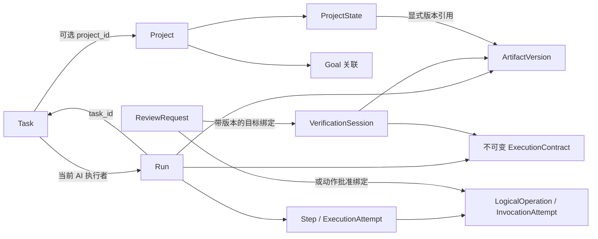

# Personal Workflow OS：领域模型与模块边界

日期：2026-09-19。状态：Proposed。本文把[四份契约](../../contracts/README.md)落实为可实现的领域边界，不代表已有代码或已接受的架构。原件已取得，对照记录见 [设计审计](../development/design-audit.md)。

角色：当前架构主入口。本文拥有领域归属、依赖方向与应用事务边界；运行细节见 [Runtime/Context](runtime-context.md)，信息/检索见[信息与计划](information-planning.md)，外部执行见[工具适配器](tool-adapters.md)，进程布局与依赖见[技术选型](技术选型.md)及[部署设计](../deployment/本机部署.md)。早期 V1_ARCHITECTURE 是历史稿，不与本文并行维护当前架构。

## 1. 本轮结论与边界

采用模块化单体、单一业务事务数据库。Project、Task、Run 分开建模，通过 ID 关联；应用用例协调必要的跨聚合短事务。聚合是保护不变量的写入边界，不要求“一次事务只能修改一个聚合”，也不要求一个逻辑模块对应一个服务或构建工程。

Windows 桌面宿主与本机服务边界见 [ADR-007](../decisions/ADR-007-windows-desktop.md)：壳管理窗口、启动和生命周期，领域命令仍经已鉴权 HTTP 进入应用用例；renderer 和壳均不成为第二业务 Owner。

本轮确定对象归属、命令责任、事务参与者与持久化约束；不选择数据库产品、不生成 DDL、不发布 HTTP API。重要取舍见 [ADR-001](../decisions/ADR-001-domain-boundaries.md)。状态枚举及迁移以契约 02 为唯一事实源，本文不复制状态机。

## 2. 领域对象与聚合

下表中的 Owner 指唯一逻辑写入者；读模型可以跨模块查询，不能借查询接口写入。聚合加载仅获取本次判断所需的数据，不加载全部项目、产物历史或执行日志。

| 边界 / Owner | 聚合根与内部对象 | 主要不变量 |
|---|---|---|
| Project | Project；独立 ProjectState 聚合 | 项目属性与 State 分别管理；State 使用独立 revision；不得保存第二份 Task 状态 |
| Goal | Goal | 目标定义独立；Project 拥有其 Goal 关联；Task 拥有显式对齐子集 |
| Task | Task；AcceptanceCriterion、ExecutorAssignment | 状态、验收版本、执行权在同一写入边界；同时最多一个 AI Run 占有执行权 |
| Workflow | Run；Step、ExecutionAttempt、ControlRequest | Run 有独立生命周期；步骤推进校验执行权、worker claim 和控制请求；终态不复活 |
| Artifact | Artifact；ArtifactVersion | 稳定逻辑产物 ID 与不可变版本 ID 分开；版本记录指向已持久保存且校验过的内容 |
| Verification | VerificationSession；CheckResult、EvidenceBinding | 绑定确定的验收契约与产物版本；已记录结果不原地改写，补验留下新证据 |
| Review | ReviewRequest；ReviewDecision | 决策绑定确切对象/内容；接受决定与执行其业务效果分别记录 |
| Permission | PermissionPolicy | 策略版本可追溯；实际调用前检查当前权限，历史批准不能覆盖当前拒绝 |
| Gateway | LogicalOperation；InvocationAttempt | 一次逻辑意图与实际调用次数分开；未知副作用不得通过新 ID 规避 |
| Resource Coordination | ManagedResource；ResourceClaim | 归一化资源独占；过期不等于安全释放；支持隔离、核对后再授权 |
| Information | Knowledge、Memory、Decision、Rule，各自有 ID 和版本 | 语义与生命周期独立；不使用一个任意类型 JSON 对象代替约束 |
| Personal Planning | 用户的 TaskSelection（Pin / Later）、FocusSelection | 用户选择持久化；Today 排序是投影；Pin 不改变 Task 可执行性 |
| Workbench | ViewConfiguration | 仅管理展示；执行配置使用单独的版本化定义，不由切换视图修改 |

Workspace 在 V1 是作用域标识与配置边界，不引入团队成员、租户隔离或权限继承树。ExecutionConfiguration、WorkflowDefinition 由 Workflow 模块管理其版本化定义；Run 固定引用对应版本。它们先服务内置流程，不构成通用流程编辑平台。

2026-09-20 补充（Proposed）：[Relay Skill](relay-skills.md) 是应用组合入口管理的只读版本化能力定义，不新增领域运行系统。Project Owner 保存 ProjectBlueprintProposal，Application 的 ApplyProjectBlueprint 协调现有 Project/Task/Workbench 写入口；Skill 不拥有 State、Permission 或 Run 生命周期。Rules/执行配置的后续建议由各自入口单独接受。取舍见 [ADR-008](../decisions/ADR-008-declarative-skills.md)。

扩展组合补充：Relay Pack 的只读定义由同一组合入口管理，项目实际配置及来源仍归各领域 Owner；不以包记录取代当前事实。Workflow Recipe 复用 WorkflowDefinition/Version；Context、Verification、Permission 与 Projection 配置分别归既有职责，不新建统一 Profile 写入模块。Proposal 只统一投影与固定命令分发，Eval 是版本回归而非业务完成裁决。具体组合/升级边界见[扩展模型](relay-skills.md#8-可组合扩展模型)。

ProjectState 是 Project 模块内部的独立写入边界，便于对状态补丁单独进行并发控制；这不允许绕过 Project 的语义校验。Goal 关联移除涉及显式对齐的 Task 时，由应用用例执行影响检查和用户明确选择的原子清理。

Information 是组织相关概念的逻辑边界，不要求实现四套基础设施。可以复用存储技术和版本机制，但 Rule 的强度、Decision 的替代关系以及来源证据必须保留明确语义。

## 3. 关系与事实来源



图中的双向 ID 引用不代表代码依赖成环。Task 只保存被授予执行权的 Run ID，不调用 Workflow；Run 只保存 Task ID 与契约快照，不调用 Task Repository。

- Project 与 Task 均通过引用关联 Goal。默认继承在读取时计算；只有显式 Task 对齐才存储子集。
- Task 可以没有 Project；Delegate 必须绑定唯一 Project。人工完成不创建虚假的 Run。
- Task 持有当前执行者和 ownership_epoch，是业务执行权事实源。Run 的历史绑定不是当前授权。
- ProjectState 保存人工选择与确认过的事实引用。in_progress 等派生字段由投影计算，不能变成可独立修改的状态副本。
- ArtifactVersion 保存内容位置、摘要、创建来源与时间；“最新版本”“当前选用版本”“验证通过版本”是三个不同问题，不共用一个隐式指针。
- ReviewRequest 的目标使用受约束的类型与绑定字段；不是任意实体 ID，也不是任意 JSON patch。动作批准可以先绑定预留的 operation_id，批准并准入后才创建 PREPARED 调用记录。
- CompletionRecord 是不可变完成凭据，由应用完成用例创建，引用 Task、验收版本、可选 Run、依据与 State 变更结果。Task 模块维护当前完成凭据引用；历史凭据不能重新驱动已重开的 Task。

## 4. 版本、身份与快照

| 字段 / 对象 | 含义与变更时机 | 不应混同 |
|---|---|---|
| entity revision | 可变聚合每次有效更新递增，用于 CAS | 不是验收条件版本 |
| acceptance_revision | 结果定义、必需验收条件实质变更或重开时递增 | 改标题排版不必递增；不能靠旧 PASS 完成新周期 |
| ownership_epoch | 授予、释放或转移业务执行权递增 | 不等同于 worker 重启次数 |
| worker claim epoch / lease | 同一 Run 的具体工作进程认领及存活声明 | 不授予 Task 或资源业务所有权 |
| resource claim token | 对归一化资源的写入准入凭据 | 租约超时不能证明旧外部调用停止 |
| command_id + payload_hash | 一次应用命令的幂等身份 | 相同 ID 不同请求内容必须拒绝 |
| run_id / retry_of | 一次 Run；人工重试新建 Run 并记录来源 | 不重开旧终态 Run |
| step_id / execution_attempt_id | 流程步骤及其执行尝试；修正或重做留下新尝试 | 不等于外部调用次数 |
| operation_id / invocation_id | 稳定外部动作意图及实际调用记录 | 重试调用不能伪造新业务意图 |
| artifact_version_id + content_hash | 不可变内容身份与完整性 | 文件名或逻辑 Artifact ID 不足以绑定验证 |
| review_id / decision_id | 待处理请求及不可变人工决定 | 决定记录不等于业务效果已成功应用 |

V1 以 acceptance_revision 区分重开后的验收周期，不再增加语义重叠的 cycle_number。完成唯一身份为 Task + acceptance_revision + 执行主体（Run 或人工），并另外保证同一 Task 验收周期最多一个有效完成凭据；命令幂等键只处理请求重放，不代替业务唯一约束。

ExecutionContract 在 Run 创建时冻结验收内容、Workflow / 执行配置版本、相关硬规则、关键输入绑定。每次 Context 构建另存 ContextManifest，包含实际采用的内容片段、来源版本/摘要、范围及构建器版本。恢复时可以生成新 Manifest，不覆盖旧快照；也不能借重新构建偷偷替换 Run 的验收契约。

当前权限和适用硬规则仍在动作/完成前重新核查。契约关键内容变化按契约 03 暂停或安全停止旧 Run，重新 Delegate；快照是历史依据，不是永久授权。

## 5. 模块依赖与端口

```text
UI / API / 定时唤醒
        ↓
Application：Delegate、Advance、ResolveReview、Control、Complete、Recover
        ↓
Project | Task | Workflow | Artifact | Verification | Review
Permission | Gateway | Resource Coordination | Information | Personal Planning
        ↓
各模块声明的 Repository / Storage / Checker / Model / Tool 端口
        ↑
基础设施适配器实现端口；组合入口注入依赖
```

跨模块写入只经应用用例与各模块公开写入口。模块不注入其他模块的 Repository，也不发布事件要求其他模块“最终补齐”必须原子的事实。模块可以返回类型化判断结果，由应用协调下一步。

建议首版只有一个应用构建单元，在内部按以上职责组织包。纯领域规则不依赖控制器、具体数据库、模型 SDK 或文件操作 API。数据库事务由应用用例包围，同一数据源的模块 Repository 必须参与同一事务，不各自提前提交。

以上为业务层组织建议，不要求所有技术机制自研。按[复用策略](复用策略.md)验证现成执行库或同机 harness；采用额外执行进程时，领域事实仍由本应用写入，执行事件与内部 checkpoint 另有明确归属，不把跨进程调用宣称为共享事务。

三个容易成环的关系这样处理：

1. Workflow 返回下一步执行要求；应用层调用 Runtime，Runtime 返回结果；应用层再次调用 Workflow 推进。Runtime 不直接更改 Task 或 Run。
2. Permission 返回 ALLOW / ASK / DENY；应用层在 ASK 时创建 Review 并让 Workflow 等待。Gateway 不调用 Review，Review 也不反向启动 Gateway。
3. Verification 返回结果及依据；应用层决定继续修正、创建 Review 或请求完成。Verification 不直接将 Task 改为 DONE。

Context Builder 与 Workbench Query 均为只读组装器。可以使用专用跨表查询提高效率，但返回投影与依赖版本，不向调用者泄漏可写 ORM 实体。只有显式应用命令能改变事实。

## 6. 应用命令与事务边界

以下是用例名，不是已发布 API。所有写命令先执行幂等检查、作用域校验和必要的 revision 检查；成功结果、关键审计与业务变更同事务保存。

| 命令 | 同一短事务的参与者 | 事务外工作 / 失败处理 |
|---|---|---|
| DelegateTask | Task 执行权 + Run/契约快照 + 命令结果 | 不在事务内调用模型；竞争失败不遗留可运行的孤立 Run |
| PatchProjectState | ProjectState + 命令结果 | 只接受类型化变更；AI 提案需单独明确接受 |
| ApplyProjectBlueprint | Project/Goal 关联、State、新 Task、ViewConfiguration + 提案终态、来源关联、回执/审计 | 只处理经确认的类型化本地变化；重查全部基线；Rules/执行配置另行确认；预览和模型调用在事务外 |
| ChangeAcceptance | Task 新验收版本 + 活动 Run 的持久控制意图 | 安全停止异步完成；新 Run 需显式 Delegate，不能立即抢占 |
| RequestRunControl | Run 的 ControlRequest + 命令结果 | 后台到安全点再 Apply；请求成功不等于已暂停/接手 |
| ApplySafeControl | Run + Task（如发生转移）+ 可安全释放的资源 claim | 前置完成在途核对；无法证明安全则不转移写入权 |
| ResolveReview | Review 决策 + 对应领域效果 + Run 等待状态（需要时） | 标准 V1 决定和 DB 效果同事务；外部动作随后走独立准入 |
| PrepareInvocation | Gateway 意图/调用 + Review 批准占用 + 必要准入记录 | ASK 时只保存 Review，不伪造已获准调用 |
| AdmitInvocation | Gateway CAS 至 DISPATCHING + 最新控制/执行权/权限/资源检查 | 提交后才调用外部系统；调用与结果保存之间可能崩溃 |
| RecordInvocationOutcome | Gateway 结果及证据 | 过期 Worker 只能提交匹配 invocation 的核对证据，不能推进 Run |
| AdvanceStep | Workflow 步骤/尝试 + 本次结果关联 | 要求正确 epoch；相同成功调用只推进一次 |
| RegisterArtifactVersion | Artifact 元数据 + 来源关联 | 内容先保存并验证完整性；事务失败留下可清理孤儿，不假装文件回滚 |
| RecordCheckResult | Verification 结果与证据 | Checker 运行在事务外；结果必须匹配 session 与版本绑定 |
| CompleteTask | Task + 可选 Run + 确定性 State delta + CompletionRecord + 关键审计 | 重核有效性、控制与未决副作用；失败只回滚 DB |
| ReopenTask | Task 新验收周期 + 当前完成投影必要更新 | 保留历史 CompletionRecord/验证；旧重放只返回旧结果 |
| UnlinkProjectGoal | Project 关联 + 经明确选择清理的 Task 显式关联 | 先展示影响；无明确清理选择时拒绝破坏子集约束 |

人工完成同样使用 CompleteTask，但依据为明确的人工接受，执行主体为 HUMAN，不伪造自动 Verification PASS。存在 AI 执行权时不能绕过安全交接直接人工完成。

ResolveReview 通过请求类型映射到固定应用用例，禁止通用“执行任意回调”。重复提交同一决定返回原结果；目标过期则返回冲突，不能将未生效决定显示为已应用。对已批准的外部动作，“决定已应用”只表示准入前提满足，真正执行结果仍以 Gateway 为准。

## 7. 并发与恢复所需的持久化约束

数据库选型必须能够实现以下语义；具体索引、锁语法与隔离级别在数据库设计阶段定稿。

- Task 当前执行者只能为 HUMAN 或一个 Run；Delegate 原子检查并写入，不能采用“先查询无 Run，再无条件插入”。
- 所有 Worker 推进命令同时校验 Task ownership_epoch、Run claim epoch 及有效控制请求；可变事实使用 revision 或锁保护。
- 完成提交与控制请求在同一 Run/Task 序列化边界竞争；建议涉及多个对象时统一按 Task → Run → ProjectState → Resource 的顺序取锁，同类多对象按 ID 排序。实际锁集合由用例决定，不无谓锁整项目。
- 动作准入与控制提交共享 Run 的串行化边界。控制先提交则禁止新准入；准入先提交则该调用按在途处理，不能声称已立即停止。
- command_id 在其作用域内唯一，保存规范化请求摘要与结果；operation_id、invocation_id、ArtifactVersion ID 全局唯一。
- 每个 Step 的推进记录必须标识消费的结果；重复结果不能触发第二次推进。修正循环使用新 ExecutionAttempt，不覆盖旧记录。
- 同一资源的互斥准入由持久化 claim 保证；父子路径、别名无法可靠归一化时拒绝作为独立并发写资源登记。
- DISPATCHING 无可靠结果转入 UNKNOWN 核对；即使租约过期，也保留资源隔离和动作关联。恢复器不得直接将其改成“失败可重试”。
- 验证结果、批准及完成凭据保存精确引用；删除或保留策略不能静默破坏历史证据，缺失明确标注不可用。
- Run 保存当前恢复位置、等待原因、resume_phase、修正预算和待处理控制请求；恢复以已提交事实判断，不靠最后一条日志文本。
- UI 通知不是命令执行证据。提交后丢失通知时，用户刷新可得到同一真实状态；当前方案不要求消息代理或事件溯源。

这些约束需要真实数据库集成与故障注入验证。仅单元测试、进程内锁或 UI 禁用按钮均不足以证明成立。

## 8. 首条纵向路径

选择“围绕项目资料形成一份有来源的 Markdown 研究摘要”作为设计贯通示例，不额外承诺新产品范围。

1. 用户建立 Project 和 Task，写明目标、资料范围、必需结果与人工/自动验收项。
2. Delegate 原子冻结契约并分配执行权；固定 Workflow 构建有版本依据的 Context。
3. Fake Worker 先生成受管 Markdown；内容保存成功后登记 ArtifactVersion。
4. Checker 验证格式、必需引用与适用规则；语义不确定或指定人工项进入 Review。
5. 人工判断仅影响绑定版本。需要编辑时先 Handoff；修改形成新版本后重新验证。
6. 完成用例核对全部前提，再原子提交 Task、Run、确定性 State 引用与凭据。
7. 故障测试在动作准入、结果保存、验证保存、完成提交前后中断；恢复不能重复副作用，也不能重复完成。

## 9. 与现有验收规格对照

| 设计责任 | 现有规格 | 本轮补充的检查点 |
|---|---|---|
| Project / Task / State | A01–A03、A08–A09 | State 独立 revision；Goal 移除与 Task 子集原子一致 |
| 规则与双视图 | A04–A07、C08 | 只读投影不持有写模型；Context 保留实际输入版本 |
| 生命周期与执行权 | B01–B08 | Task epoch 与 worker claim 分离；安全控制才移交 |
| 验收与人工判断 | C01–C09 | Review 决定、DB 效果、外部执行三者可区分 |
| 恢复与提交 | D01–D11 | 模块 Repository 同事务；准入/控制串行化；重开后的完成唯一约束 |

以上为设计审查映射，不增加一套重复编号，不表示 37 项测试已通过。

## 10. 下一步及待确认项

已进一步形成[数据库逻辑模型](../database/logical-model.md)、[技术选型](技术选型.md)、[PostgreSQL 物理设计](../database/physical-design-postgresql.md)、[API 契约](../api/http-command-contract.md)与[首条工程切片](../development/first-human-slice.md)。物理层补充 Authority → Task → Run → ProjectState → Resource 的锁序，以及批准占用和调用绑定拆分。当前阶段与下一任务统一见 [CODEX_NEXT_STEP](../../CODEX_NEXT_STEP.md)，不在本文另排进度。

仍待确认：原件对照中的待确认细化、依赖精确补丁和组合验证、内容存储的目标平台保证与保留策略、具体 Workflow/Checker 的首版集合。数据库方面用户已确认允许本机 PostgreSQL，技术细节以选型草案为准。

本轮未更改四份契约的产品语义、状态枚举或安全范围；新增的是实现责任分配与并发落点。未改动 Manga 项目，未建立运行时代码。

## 11. V1 后续协作的架构演进提案

2026-09-28，Proposed；本节仅定义[后续路线](../requirements/post-v1-roadmap.md)的责任与一致性边界，不宣称已有实现。方案比较和理由归 [ADR-013](../decisions/ADR-013-bounded-project-continuation.md)，详细命令/字段在各片开工前进入 API/数据库主文档。

### 11.1 对象与唯一责任

| 增量 | 逻辑 Owner | 只允许保存的新增事实/引用 |
|---|---|---|
| 项目接续点 | Project | 接续点身份、说明及一致的版本引用集合；不复制 Task/Run 当前状态 |
| 跨成果候选组 | 原 Proposal/Assist 用例协调，Artifact 拥有版本与锁 | 候选关联、源/目标基线及逐项处理回执；不成为第二 Artifact 库 |
| 知识导读/组织 | Information | 有范围的编排与 Knowledge/Artifact 等引用；Context/搜索仍为只读投影 |
| 周期计划 | Personal Planning，应用用例提交 Task/Goal 变化 | 计划候选及处理来源；实际 Task 状态仍归 Task |
| 有限触发 | Personal Planning 拥有触发配置，Infrastructure 负责时钟/唤醒 | 配置版本、触发发生身份、领取/命令关联和处置；不授予执行权 |
| 有限连续委托 | Application 协调项目执行授权，Workflow 仍拥有各 Run | 用户授予的范围/预算、撤销与原 Task/Run/command 关联；不另造任务完成状态机 |
| Skill/Profile 配置 | 既有声明注册与配置入口 | 固定版本、允许引用及 Eval 证据；不载入可执行代码 |

这是逻辑分工，不是一项一个服务、表或包。队列/计划中的“完成”只能是原 Task/CompletionRecord 的投影；若确需调度领取状态，必须与业务状态明确区分。

### 11.2 用例与事务

检查点捕获在数据库一致性快照内读取对象及版本引用；内容文件复用既有不可变存储和 hash。引用集合需要保留/删除约束，不能在保存后被清理策略悄悄破坏。AI 导读生成在事务外，绑定捕获基准；当前权限改变后仍须遮蔽历史受限来源。

候选组默认逐项调用既有命令，保存每项回执和部分成功；没有共同事务协议时不显示整组原子完成。跨成果组合验收绑定确切版本集合及验收/检查基准，任何依赖变化使相关结果失效，不修改历史成绩。

触发记录与投递请求按稳定身份幂等持久化，唤醒丢失由扫描补偿；建议生成另绑定其原执行/模型调用身份，不以重复调度重付模型成本。定时器不推进 LangGraph、不写 Task。排队/时区/错过触发语义须在 N05 冻结。

连续委托在应用用例内原子检查授权有效性、Task revision、资格和预算预留，再调用原 Delegate 与命令入口。不得依赖“先查还有预算、事务外再创建 Run”；跨 Worker 预算需要持久原子预留，单进程计数不算全局限制。用量未知的预留不能静默释放。具体锁顺序需与现有 authority、Task/Run、资源锁核对并以真实 PG 验证。

### 11.3 版本、停止与恢复

提案接受、触发启用、执行授权、动作批准、业务完成各自有独立含义和确切基线。读取原件、保存知识或打开页面不能自动跨越其中任何一步。

撤销授权先持久化并阻止新的准入，再对已运行任务请求原控制；停止请求不是停机证明。Delegate 回执丢失按原 command 查回执，不换 Task/Run 或授权身份重新执行。原调用 UNKNOWN 保留动作/资源隔离，不因用户改计划、停触发或更换执行器释放。

首片关闭桌面即停止新调度；重启后先恢复持久事实并执行已确认的漏触发/继续策略。不安装后台服务、不宣称关闭应用仍运行；需要这一能力时重新设计宿主与部署边界。

### 11.4 接口和演进边界

现有 UI/API/Application/Domain/Repository/Infrastructure 依赖方向保持。新增接口采用专用命令和带版本的只读 DTO，沿用幂等/错误/权限协议，不增加通用 JSON Patch、任意工具转发或直写接口。API、物理 schema、OpenAPI、迁移与兼容策略在每包实现前冻结；本轮没有发布 API 或数据库变更。

React、Tauri、Node、Fastify、Kysely/PostgreSQL 与 LangGraph 的技术职责不变。性能瓶颈先测排队、首内容、持久化和渲染，必要时做局部优化；新解析器、索引或外部执行器按证据单独选型，不凭后续路线一次安装全部候选依赖。
