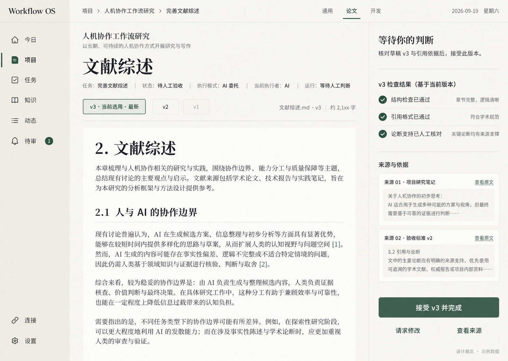

# Relay 工作台视觉与组件规范

> 2026-09-24：工作台已以 React 组件复用原 CSS 与唯一 token 源；迁移前 Vue 原件和 15 张旧页面图归档于 [M02 开发记录](../development/m02-react-migration.md)。浏览器逐页对照与真实 Windows 窗口分别记录，前者不代替后者。

状态：Proposed（从现有图提炼的实现基线）。更新：2026-09-29。

2026-09-29 协作重心改造：旧图继续约束既有风格与局部组件参考；目标信息层级改按[工作台第 14 节](workbench-design.md#14-以目标协作为中心的工作台改造)及本文第 5.1 节。新增方向本轮仅写入文档，未生成或选定新视觉稿，未改 token、CSS 或组件；旧图不能被视为目标布局已经验收。

本文只拥有视觉、布局、组件外观与可访问性交互规则。用户已确认 Windows 可安装桌面应用，宿主边界见 [ADR-007](../decisions/ADR-007-windows-desktop.md)。页面路由、业务状态、权限和命令仍以[工作台交互](workbench-design.md)及其引用契约为准；技术依赖以[技术选型](../architecture/技术选型.md)为准。数值唯一来源为 [design-tokens.json](design-tokens.json)，本文用 token 名称引用，不再维护一套色值表。当前 React 工作台保留原页面 class 与布局，真实桌面验收由 M02 整体验收记录确认。

## 1. 视觉依据与提取边界

既有设计图是风格与历史页面依据。以[原始论文验收页](../../thesis-review-original-20260919.png)为视觉锚点，[今日](mockups/2026-09-19/today.png)、[项目总览](mockups/2026-09-19/project-overview.png)、[开发工作台](mockups/2026-09-19/development-workbench.png)呈现跨页面共性；[生成提示词](mockups/2026-09-19/prompts.md)只记录来源，不是运行规范。协作主区和产物区的目标布局按第 5.1 节另行选稿，不强制还原旧管理页面的信息主次。

| 可观察依据 | 规范化处理 |
|---|---|
| 暖白主画布、略深暖灰侧栏、近白文档区域 | 使用 canvas / navigation / surface 三层语义背景；普通内容不逐块套卡片 |
| 墨绿主按钮、细绿色激活线、少量浅绿选中区域 | 一个主操作色；激活同时有文字/位置/线条，不能仅换颜色 |
| 宋体或明朝体大标题、清楚的界面文字、等宽 diff | editorial / ui / code 三类用途；无法从图片确认实际字体名 |
| 细分隔线、近直角小圆角、大块留白 | 默认无阴影；阴影仅用于浮层，不复制生成图的纹理或渐变噪声 |
| 左导航、顶部上下文、中央工作区、右侧判断/上下文 | 统一页壳；右区内容由页面任务决定，不叠加第二条 AI 侧栏 |
| 状态、模式、执行者与版本并列可见 | 它们是独立事实字段，不能压成一枚“AI 处理中”标签 |

提取分三类：**图像依据**是上表的稳定视觉特征；**归一推荐值**是 token 内的颜色和桌面尺度；**补充规则**是图中未展示的 hover/focus、错误、断点、动效和键盘行为。后两类均待真实页面验证，不称为原图测量真值。

采样方法：四张图按原始像素读取 RGB，在侧栏 (120,700)–(180,760)、画布 (800,75)–(1000,90) 的空白区域取通道中位数。原图与生成图的背景略有漂移，因此统一为 tokens 中的平面颜色。大多数图为 1487×1058，项目总览为 1486×1058；这是图像像素尺寸，不是桌面 WebView 的 CSS 缩放/DPR 证据。布局约 203px 侧栏、65px 顶栏仅作归一参考。

图片里的“Workflow OS”、Rust 片段、日期、用户项目和通过结果均为示例。仓库名称 Relay 不意味着本轮已决定改图中品牌标识；最终产品显示名待确认，不影响本规范的样式定义。

Windows 桌面宿主当前图标使用[透明机器人优化图](../../apps/desktop/src-tauri/icons/icon-source-20260929.png)。用户于 2026-09-29 确认继续保留透明背景，并增强机器人主体与橙色徽章在任务栏小尺寸下的辨识度。该来源为 1254×1254 RGBA 图；[产品 PNG](../../apps/desktop/src-tauri/icons/icon.png)与[ICO](../../apps/desktop/src-tauri/icons/icon.ico)均以它作为当前输入，ICO 保持 256px 层位于首层，供 Tauri Windows 默认窗口图标解码。ICO 仍由 Tauri bundle 配置引用。[上一版透明机器人原图](../../apps/desktop/src-tauri/icons/icon-source-20260928-v2.png)和[更早的深蓝方形来源](../../apps/desktop/src-tauri/icons/icon-source-20260928.png)作为历史素材保留。本次只调整图标视觉，不改变业务状态或交互语义。图标接入历史与验证边界保留在 [M02 开发记录](../development/m02-desktop-foundation.md)。

## 2. Token 规则

token 文件使用本项目简单扁平结构：metadata 保存版本/状态/来源，tokens 保存命名值，contrastChecks 保存需要验证的前景/背景组合。不声明遵循某一外部 token 交换标准，也不引入主题构建工具。

- 基础值：color.palette.*、space.*、font.* 等。
- 语义值：color.bg.*、color.text.*、color.action.*、color.status.* 等，只能引用基础色或明确的语义别名。
- 可复用尺度：layout.*、control.*、radius.*、focus.*、zIndex.*、motion.*。
- 组件消费语义 token，不在页面上复制色值。文字链接用 action.text，不能因主按钮同色就把链接和按钮行为合并。
- 别名写作 {color.palette.forest}；检查器必须发现悬空、循环及类型不匹配。
- 未来 CSS 映射使用 --relay-color-bg-canvas 这类名称，按点转短横线；当前不生成或宣称已有 CSS/Tailwind 接入。

本轮只定义 light。没有暗色参考，不自动创建深色主题或主题切换按钮；保留语义命名使未来可以扩展。色值变更只改 JSON；用途和组件规则改变才改本文。token 改名/删除时查所有消费者并记录迁移，不维护多个“最终版”文件。

## 3. 色彩与状态

| 用途 | token | 使用限制 |
|---|---|---|
| 应用画布 / 导航 / 文档内容 | color.bg.canvas / navigation / surface | 右区与主画布同底，不做独立深色 IDE |
| 标题 / 正文 / 辅助信息 | color.text.primary / secondary / muted | 版本、错误解释和证据不因“次要”变为不可读 |
| 主操作及 hover / pressed | color.action.primary / hover / pressed | 文本固定 onAction；避免 hover 放大或跳位 |
| 当前导航/版本/行 | color.selection.bg / text | 配合激活线、勾选或当前标记；hover 与 selected 分开 |
| 装饰分隔线 / 表单边界 | color.border.separator / control | 浅分隔线不能承担唯一控件边界；输入框使用 control |
| 成功 / 警告 / 危险 / 中性 | color.status.*.text / bg | 同时有文字和图标；警告与危险为原图未覆盖的补充 |
| 增行 / 删行 | color.diff.add.* / remove.* | 保留 + / − 和行号，正文用 primary；不单靠红绿辨认 |
| 焦点 | color.focus.ring + focus.width / offset | 与 selected 边框不同，不能仅靠背景变化 |

成功色表达“这一条检查通过”，不推导 Task 完成。待审批用中性状态配明确动作，UNKNOWN 使用警告和核对说明；失败用危险色。暂停/正在停止/待核对的文案及允许操作由工作台契约决定，视觉组件不能自行映射业务状态机。

禁用状态使用 disabled.bg / text 并提供可见原因；本规范仍对禁用说明保持可读性，不通过整块 opacity 让文字和边框一起淡掉。

## 4. 字体与排版

| 角色 | 尺寸 / 行高 token | 字体 / 字重 | 用法 |
|---|---|---|---|
| 今日主标题 | font.size.compactPage / font.lineHeight.heading | editorial / semibold | 仅一个顶级主标题，允许换行；2026-09-28 按用户反馈从 display 调整为 compactPage——空态与窄窗不再铺展示型尺寸，宽窗如需更大另行评估，不无条件恢复 display |
| 普通页面标题 | font.size.page / heading | editorial / semibold | 项目名、验收标题、变更审查标题 |
| 窄屏页面标题 | font.size.compactPage / heading | editorial / semibold | 不把整页缩放来容纳桌面标题 |
| 区域标题 | font.size.section / heading | editorial / semibold | 今日焦点、项目状态、等待判断；零数量的分组标题收为一行提示，不以区域标题占位 |
| 行标题 | font.size.rowTitle / ui | editorial 或 ui / medium | 任务/产物名称，长名换行 |
| 控件与业务正文 | font.size.body / ui | ui / regular 或 medium | 按钮、导航、状态、字段；文本输入与下拉继承 UI 字体，不落回浏览器默认字体 |
| 辅助信息 | font.size.meta / ui | ui / regular | 时间、来源、版本；不能承担长正文 |
| 长文阅读 | font.size.reading / reading | editorial / regular | 论文/Markdown 阅读内容；编辑输入保持清晰 |
| 代码与 diff | font.size.meta / code | code / regular | 保留等宽与可复制文本；不使用图片充当代码 |

字体栈是推荐回退，图中字体不可反推出精确 font-family。优先本机可用字体；若要随应用分发字体，先核验许可和实际字符覆盖。无衬线用于交互，宋体用于阅读与标题；不要把宋体扩散到全部小字号元数据。不得假定所有回退字体都具备 semibold，实装需检查字重、行高及中文标点。

尺寸采用 rem，默认字号变化时同步缩放。中文正文不加夸张字间距；时间/计数可用等宽数字。主体文字禁止固定高度裁切；面包屑可截断中间层，但当前任务名必须有可见完整入口。阅读宽度受 layout.reading.maxWidth 限制，超宽显示器不拉长整行文章。

## 5. 间距、页壳与桌面窗口适配

2026-09-28 设计接续：用户要求标题栏左侧放常用操作，不显示 `Relay Agent`。[完整窗口 v2](mockups/2026-09-28/README.md)展示左侧后退、前进、搜索、新建任务，中间空白拖动区，右侧最小化/最大化或还原/关闭。该共享窗口层适用于全部页面，旧图仍仅定义页面内容。操作区已接入工作台代码；效果图本身不构成真实 Windows 验收。

标题栏与下一层应用顶栏分开；面包屑及适用工作台页签仍在应用顶栏，不重复放一组快捷操作。高度及窗口按钮宽度复用 `control.height.comfort`，其他颜色、字体、图标、细线与留白引用现有 token；不从概念图建立第二套数值。只有中间空白参与拖动/双击，所有按钮及浮层排除拖动命中。窄窗优先隐藏快捷键提示和可替代的文字标签，保留可访问名称、焦点和窗口按钮。浏览器不显示桌面控制时，业务搜索和创建入口仍应可达。具体动作及草稿保护见[工作台第2节](workbench-design.md#2-信息架构与路由)。

现有图定义应用客户区，不包含 Windows 原生标题栏。当前 Windows 主窗口使用浅色自定义标题栏，复用 navigation 背景、UI 字体、separator 和 `control.height.comfort`；图中的应用顶栏继续承载面包屑等内容。左侧操作按钮与中间空白拖动区分离，只有空白区可拖动、双击切换最大化；右侧窗口按钮有独立命中区，关闭请求仍受未保存草稿确认保护。桌面搜索复用 Ctrl+K 命令面板，应用顶栏原搜索图标在桌面隐藏；浏览器顶栏入口保留。连接中和服务失败页保留窗口控制，业务操作禁用；浏览器预览不显示桌面标题栏。侧栏高度扣除标题栏，侧栏和应用顶栏的 sticky 起点移至标题栏下方；跳转主内容链接聚焦后显示在标题栏下方，不覆盖窗口按钮。窗口启动/关闭交互按[部署设计](../deployment/本机部署.md)，不新增托盘或多窗口。

window.content.initialWidth/initialHeight 与 minWidth/minHeight 为客户区逻辑 DIP 推荐值；不按截图像素设置窗口。首次打开和恢复窗口位置时，依据当前显示器工作区扣除系统边框/标题栏后限制尺寸和位置；工作区小于推荐最小值时允许继续收缩，避免窗口伸出屏幕。DIP 与 CSS px/rem 分开处理，不手工重复乘 Windows 缩放倍数。

沿用图中的疏朗密度，以 space.* 形成 4px 基础、8px 主节奏。文字与图标用小间距；字段内关系、列表行和区域之间按层级增大；不为每一个偏移增加 token。

| 区域 | 尺度引用 | 规则 |
|---|---|---|
| 左导航 | layout.sidebar.width / control.nav.height | 暖灰背景、底部连接与设置；长页面可滚动，不挤压底部项；≥64rem 可拖拽调宽（10–20rem，双击复位，键盘可调），用户宽度只作用于宽断点基础列 |
| 顶栏 | layout.header.height | 面包屑、视图切换、日期按可用宽度排列；日期不阻塞主要操作 |
| 中央工作区 | layout.main.padding / layout.section.gap | 对齐统一左边线；区块用留白和细线分组 |
| 右判断区 | layout.rail.width / narrowWidth | 左侧细分隔线；有独立标题、证据、范围及操作；内容滚动可达 |
| 内容上限 | layout.content.maxWidth | 超宽屏限制工作区总宽度，避免按钮远离对象 |
| 阅读区域 | layout.reading.maxWidth | 文档内可有自己的标题节奏，不套多层卡片 |

| 桌面客户区的 CSS 视口范围 | 页壳行为 |
|---|---|
| ≥ breakpoint.wide | 完整侧栏 + 中央内容 +标准右区；接近原图比例 |
| breakpoint.rail 至 wide | 完整侧栏 + 中央内容 +窄右区 |
| breakpoint.large 至 rail | 完整侧栏；右区由明确“查看待审/上下文”按钮打开，不挤窄正文 |
| breakpoint.medium 至 large | 导航收为 compactWidth；必须可展开文字并提供可访问名称；右区按需打开 |
| < breakpoint.medium | 左导航抽屉；内容单列；右区按需全宽面板/对话框，保留目标与返回入口 |

抽屉不互相叠开；打开时按组件规则管理焦点。原图右区底部操作不得用绝对定位压住内容；采用正常流或带内容留白的 sticky 区，窗口缩小或字号放大时仍能滚到操作。正文不产生全页横向滚动，diff/宽表允许局部横向滚动并保留键盘访问。窄窗口内边距使用 layout.main.smallPadding。

断点是桌面窄窗口、文字缩放和高 DPI 下的补充适配规则，不代表手机端交付。验收覆盖推荐初始/最小客户区、最大化/还原、较小显示器工作区、100%/125%/150%/200% Windows 缩放与跨不同 DPI 显示器移动。另在 200% 内容缩放下检查重排；记录实际 DIP、CSS 视口与 DPR，不只记录截图分辨率。

### 5.1 协作工作区的视觉层级

2026-09-29，用户已选方向 1「对话主轴 · 双页工作桌」；[完整窗口修订图](mockups/2026-09-29/collaboration-dialogue-window.png)补入用户指出遗漏的 Windows 标题栏，[原选稿](mockups/2026-09-29/collaboration-dialogue-selected.png)保留选择依据。本轮已授权实施并在 `/agent` 落地（开发自检），**真实 Windows 窗口验收仍未完成**；本文只定义呈现规则，操作与状态以[工作台第 14 节](workbench-design.md#14-以目标协作为中心的工作台改造)为准。

- 主视觉优先给当前工作目标、可读产物、实际执行进展和必要判断。减少占据首屏的统计卡、概览大标题、重复状态块与长期空白面板；不靠机器人图标、发光装饰或聊天气泡数量表现 Agent 能力。
- 输入区是持续协作入口，显示作用目标、发送意图及需要注意的范围。执行中仍可阅读结果和访问控制；是否可发送、编辑或委托由真实权限和接口决定，布局不制造能力。
- 对话与产物采用可调整主次的工作区域。讨论时对话为主，阅读/修改时产物为主，等待判断时将证据与对应操作靠近；不默认固定左右各半或强迫两区同时常驻。
- 进展使用有事实依据的阶段、最近结果和原因。普通步骤可以展开查看；阻塞、外部结果待核对、过期、失权和执行权必须持续清楚可见，不能收进普通日志。
- 项目/任务列表保留检索与管理能力，视觉上服务于定位当前工作。ID、hash、调用元数据进入详情，结果内容和可读来源名称优先；不得隐藏决定所必需的版本与范围。
- 既有暖白、墨绿、字体、细线与留白继续使用唯一 token 源。本轮不定义新色值、列宽或动效数值；新布局比例在选稿后按真实内容验证。
- 上表断点仍作为适配基线，完整右区仅在确有内容且用户需要时显示；窄窗可切换讨论/产物/判断视图，但保留当前目标、执行状态和必要操作。不以整页缩小维持多列，不让持续输入区遮挡正文或审批按钮。
- 新进展不抢走正在阅读或编辑的焦点，键盘可达输入、产物和控制区域。减少动效偏好下仍可辨识运行与等待；状态播报不逐 token 打断阅读。

新视觉稿须展示工作进行中的内容和状态，不能只以聊天空态作为改造完成依据。旧截图可作风格和兼容对照；目标体验还需按[协作主线验收](../testing/verification-plan.md#16-agent-协作主线验收提案)证明完整路径。

选定工作区从上到下分为共享 Windows 标题栏、应用上下文栏和工作内容。标题栏沿用第 5 节已定义的后退、前进、搜索、新建任务、空白拖动区与最小化/最大化或还原/关闭；不放品牌名，不叠加第二条原生标题栏。下方上下文栏只放 Project/Task 定位和必要状态；桌面搜索不在此重复。所有状态稿都画完整窗口，不能以裁掉标题栏的内容图代替。

2026-09-29 实现补充：按修订图复核后，协作工作区实际排布为「全局左栏（近期工作）→ 顶部目标与事实条 → 对话中栏 + 右栏三页签」。首版的协作页内嵌左栏与图不符，已合并进 `AppShell`；主导航相应改为项目/全部任务/知识，今日、动态、待审、连接、设置收在次级分组，路由与深链接不变。

目标区在宽窄窗都常驻，承载 Project/Task 定位、目标、事实条与工具带，因此切换右栏页签不会让目标与必要介入提示消失。执行控制默认折叠为一行状态，状态文本常驻可见，仅在有控制请求、未结清动作或失败时自动展开——折叠只影响呈现，不隐藏控制入口与执行权事实。工具面板占用右栏而不是叠加第四列。断点沿用上表：≥`breakpoint.rail` 为三列，低于它按右栏页签切换，不缩小三列。

2026-09-30 对图复核后的局部呈现：项目上下文行放状态标签，目标标题独占下一行；项目名、事实条标签和文档名按已有字重 token 加强层级。判断区采用浅绿标题带和白色正文，完整版本身份以 metadata/code 样式常驻，详细证据折叠；不能为了减小卡片而隐藏决定必需的版本与条件。讨论去除继承的重复卡片间距，近期工作用窄左线与低饱和选中底色。只调整协作页局部规则，不新增字体依赖、色值或第二套 token。确切视口、对照迭代和生成图无法确认的字体差异归[视觉 QA](../../design-qa.md)。

本轮新增的 token 只有布局与控件尺寸：`layout.workspace.sideWidth`、`layout.workspace.centerMin`、`layout.factbar.columns`、`layout.factbar.cellMin`、`control.avatar.size`。没有新增色值、圆角、时长或动效曲线，也没有复制第二套数值；消息头像、日期分隔线、事实条三格和右栏页签全部复用既有 token。

对话消息的视觉约定：角色同时由头像文字（我/AI）、角色名与底色表达，不只靠颜色；时间戳取服务端既有 `created_at`，缺失时不显示时间而不是编造；正常完成态不额外标注状态词，等待生成、正在生成、生成失败和已取消必须显式表达。

| 状态或区域 | 已选方向的呈现规则 |
|---|---|
| 双页基础 | 全局左栏导航、中央对话与输入、右侧独立产物区；用细分隔线组织，不把所有内容包装成气泡。无产物时回收右区，不放空白结果卡 |
| 阅读与判断 | 正文、版本、来源和 Review 操作在同一阅读区域；文档头标明文件名·版本·已保存状态·最后保存时间，正文默认展开确切版本；长文或 diff 展开后让正文占主区，保留返回讨论的位置 |
| 执行与等待 | 执行进展收在右栏检查页签，不占据对话主区；对话上方只保留事实条三格与工具带。生成中预览与保存版本使用明确文字。等待判断不显示为已暂停；运行控制请求和执行权状态常驻可见 |
| 错误与待核对 | 原因紧邻受影响区域；外部结果待核对持续显示，不只用 toast；未知状态不使用成功绿勾 |
| 人工修订 | 取得执行权前只读；确认接手后才显示编辑和保存新版本。冲突对照不覆盖输入，不让工具栏暗示已取得编辑权 |
| 完成 | 展示已确认的完成凭据与确切版本；输入区和下一步入口不表现为自动开始新工作 |
| 宽度收缩 | 继续使用第 5 节断点。先收次级信息和导航，再把右区切成“讨论 / 产物 / 判断”单区域；不强留三列，不通过缩小整页维持选稿比例 |
| 高度收缩 | 内容可用高度先扣除标题栏与上下文栏；降低标题和空白占用，正文与讨论分别滚动。输入及判断操作在正常流或有底部留白的 sticky 区，短窗口仍能滚到末段和按钮 |
| 键盘与窗口操作 | 标题栏按钮排除拖动；空白拖动/双击、最大化还原和草稿保护沿用宿主。导航抽屉与证据面板不叠开；焦点回到触发点；中文输入法组词时不误发送 |

新图由内置图像生成工具修订原选稿，修订要求为：加入独立共享标题栏，移除上下文栏重复搜索，重排内容以保留输入和判断按钮，将等待判断与 PAUSED 分开，将只读版本的入口改为“展开阅读”。图中文字和比例仅供方向评审；字体、颜色、间距和窗口尺寸继续使用现有 token。选定方向没有新增色值或承诺新的分栏拖拽能力，精确布局须在后续获授权实现时按真实文字与窗口验证。

## 6. 可复用组件规则

方向 1 的开发工具补充见[开发场景图](mockups/2026-09-29/collaboration-development-tools.png)及[交互第 14.9 节](workbench-design.md#149-开发工作的工具入口)。保留完整标题栏；工具入口置于其下的工作区工具栏，采用图标加“文件 / 变更 / 终端 / 运行记录”文字，不放入窗口控制区。右区在产物、文件和 diff 间切换，终端/执行输出使用底部面板；不再叠加第四列。缺能力以“待接入/待设计”解释，未读到分支与变更不能显示虚构计数。图中的“运行”及播放图标以交互规范的“运行记录”语义为准。

底部面板打开时为正文和输入重新分配高度，不覆盖输入或判断按钮；窄窗可独占内容区并保留返回入口、目标和必要介入提示。关闭/展开按钮与停止进程操作在文案及位置上明确分开。diff 用既有增删 token 与行号，不仅靠颜色；长行局部横向滚动。终端不强制深色主题，不新增第二套视觉 token。图中样例文件和增删数量仅示范排版。

只规范已有图和首条工作流需要的组件，不创建通用页面编辑器或整套组件代码。

| 组件/组合 | 外观及 token | 状态与交互 |
|---|---|---|
| AppShell / NavigationItem | navigation 底、ui 字体、control.nav.height；当前项有色块/竖线 | 路由链接使用 aria-current；hover、focus、current 分开；待审计数来自真实查询 |
| Breadcrumb / ViewTabs | 细字与绿色底线，无大块 pill | 导航使用链接；同页 Tab 才使用 tablist/tab/tabpanel 及方向键，不给路由伪装 Tab 语义 |
| Button / TextAction | height 或 prominent，control 圆角；主要实心、次要描边或文字 | 默认/hover/pressed/focus/disabled/loading 全部定义；文字动作保留可辨认链接样式 |
| TextField / Textarea | surface 底、control 边界、ui 字体 | 可见 label；required/错误说明与字段关联；不以 placeholder 代替标签；保留用户草稿 |
| StatusLabel / MetadataRow | 轻量文字+图标，badge 圆角；不把普通标签做成按钮 | Task 状态、执行模式、执行者分别渲染；状态代码不由颜色决定 |
| VersionSelector | 当前版本细绿边框/浅绿底，其余低强调 | “当前选用”“最新”“本轮接受”分别呈现；点击查看不等于接受 |
| TaskRow / ArtifactRow | 行式布局、separator、row.minHeight | 主名称可打开，独立动作有独立焦点；不嵌套可点击按钮；长名称换行 |
| EvidenceItem / CheckResult | 来源卡仅一层轻边框；检查行用图标+文字+证据链接 | 真实绑定版本可见；结果不确定时不显示绿勾；来源失效明确说明 |
| ReviewPanel | rail + prominent 主按钮；前置展示版本、证据、范围 | “接受产物”“批准动作”“接手编辑”分开；过期或无权限不能继续提交 |
| DiffView | surface、code 字体、行号和增删背景 | 文件树与 diff 分区；局部滚动；仅接受隔离变化集不能表述成已写回/commit |
| Dialog / Drawer / Menu | panel 圆角、floating 阴影仅浮层、相应 zIndex | 有标题/关闭按钮；模态焦点限制与返回触发点；Esc 不丢弃未保存输入 |
| FeedbackRegion | 就地描述错误、空态、加载和待核对 | 保存/恢复重要反馈持续存在；toast 仅辅助，不能承载唯一证据或审批结果 |

M05 P14 三工作台切片沿用项目页壳、右判断区、路由链接、行式列表与 `subnav` 激活线。标题下并列显示固定 Project Type 和 State phase；主区用既有 `space.*` 留白及 `color.border.separator` 细线分组，任务状态仍由 `StatusChip` 的文字与语义色表达。分页、来源读取失败和工具未接通都使用就地文字，不给空白数据加“已全部完成”的视觉暗示；来源 ID、引用字段和版本允许换行，窄窗口标题与刷新按钮纵向排列。该局部样式只引用已有 token，未新增视觉数值或动效；视觉规则不改变只读视图的业务边界。

0024 ViewConfiguration 区域复用现有 panel 边线、表单、主次按钮与成功/冲突文字状态。默认 kind、View 修订、服务端模板版本和完整 SHA-256 与页面顺序同区展示；长 hash 自动换行。临时浏览和“设为默认”用不同文案，待核对命令显示原 ID、原修订与目标 kind，避免将路由切换误认作已保存。未引入新 token 或逐页拖拽控件。

0025 蓝图 live 页将 Skill 生成、人工草稿、服务端候选 Diff、后续配置建议与显式应用分为独立 `surface-panel`。生成中显示原 Assist 会话/消息 ID 与排队、运行或失败状态；候选区显示来源、完整 SHA-256、三项基线修订与模板页面实际顺序；右侧确认区只显示服务端已存候选的 Apply/Reject 和回执核对。人工草稿与 Skill 来源用文字区分，不能共用“已生成”状态。现有 `warning-callout`、`action-error`、`success-callout` 传达冲突、失效、待核对和实际应用效果；长 ID/hash 自动换行，不新增 token。

项目 Connections 设置沿用相同项目 `subnav` 与行式列表：Connection、受管资源、PermissionPolicy 三段独立显示，状态、修订与 ID 紧靠对象，长路径/主机与版本目标允许换行。危险操作采用既有 `danger-button`，不因停用/撤销抹去列表或历史。表单默认 DENY，资源和主机随 capability 显示；冲突提示保留原 command_id 与草稿，响应不明以警示块给出回执查询和同 ID 重试，其他提交暂禁用。fixture 提示和 live 加载/错误就地显示，只使用既有语义 token；连接目录未读回以可读文字说明，不用空白字段暗示无边界。此处不引入新 token 或桌面视觉验收结论。

全局命令面板复用 `AppDialog` 的遮罩、焦点封闭、Esc 与焦点返回，初始焦点落在搜索框；顶栏图标按钮提供可见入口和快捷键说明。搜索行可换行显示标题、类型/版本、正文摘录与来源引用，项目/任务操作旁保留不可用原因，灰态不隐藏实际业务限制。首次创建提示沿用 `warning-callout`，live 模式将项目创建、待预览蓝图意图与单独资料登记的结果分段显示；资料待核对区保留原 command ID、SHA-256、查询和同 ID 重试，成功后清除会话中的正文。Today 的 fixture 模式明确无真实投影，live 模式按服务端分组显示任务。Today 日期、时区和任务计划控件有可见 label；候选/受阻状态同时用文字呈现，Pin/Later/Focus 与可开始状态分开；依据、证据和允许操作可展开查看。命令响应不明时原 ID、回执查询及同 ID 重试在同一区域可见。Activity 用普通列表、细分隔线和可换行的来源链接；筛选字段有可见 label，时间边界文字与已读条数就地显示，权限错误清空旧列表。Run Trace 用原页内按需展开的分组列表展示证据，Review、Gateway 和 Effect 各有独立标题及状态，不靠颜色暗示动作成功。Lineage 用版本摘要和直接父来源列表，只有可读产物版本显示深链；不可用来源的说明代替 ID。刷新和权限错误在原区域移除旧证据。局部样式只消费既有 token；键盘组件自检不等于 Windows 辅助技术实测。

主操作在一个任务决策区内保持一个；次要动作低强调，危险动作用明确动词与目标。不得因为原图只有一个绿色按钮，就把所有决定复用成“继续”。loading 保持按钮宽度，说明“保存中”或“正在核对”；长后台 Run 不将整个页面锁死。提交禁止重复触发，但重试/回执行为仍按应用契约。

任务 Skill 两个 live 事实页沿用 `surface-panel`：当前 Task/验收事实、Assist 合并提案入口、Run/Verification 历史来源分段排列，来源版本和 CheckPlan hash 可换行。无 Run 指针与证据读取失败用文字说明，刷新时清除旧事实；任务定义/验收页的 Assist 是普通导航链接；服务端提案的确认按钮只在 Assist 中出现。fixture 页继续呈现交互预览，不能共享 live 的状态标记。

live 全空间任务与收件箱沿用任务表格、状态徽标与现有筛选控件；列表上方就地显示“已加载 / 当前显示 / 后续页”三种范围信息，加载更多仅追加服务端游标页。筛选提示必须写明只覆盖已加载任务；加载与失权错误移除旧行，不能以旧计数暗示仍可读取。项目列表同样标明当前归档范围、已加载数和后续页，下一步显示确切 Task ID 而非未读标题；真实归档先弹出确认，阻断原因与原命令回执在列表上方就地显示。

live 新建任务的 Project 选择保留原手动 ID 字段，在旁边按需展开真实进行中项目列表；列表行仅提供显式选择，搜索、已加载数与后续页提示沿用上述范围语义。创建命令结果不明时冻结表单并在原 ID 回执核对后才显示原样重试入口；跨 Workspace 切换清除旧列表和未提交的 Project 选择。

已归档 Project 的首批项目级页面复用现有 `disabled-reason` 提示：禁新的蓝图、连接/权限、默认视图、项目任务开始/创建和 Project Assist 写入（含新取消）；原命令回执核对与同 ID 恢复按钮保持独立可用。Project 事实未确认时也按禁新写显示原因，历史只读区域仍保持可辨的原样式；项目任务切范围后先清旧快照，未决开始命令仅在原作用域显示恢复入口。

Inbox 快捷入口复用顶栏既有 `icon-button` 形态，提供可读的名称与键盘焦点；`/inbox` 跳到原收件箱页，不添加新的一级侧栏样式或 token。命令面板中 Inbox 与 Activity 都是导航，分别在目标页读取事实。

### 组件状态补充

- 空态：说明没有什么、为什么以及下一步；无模型连接仍可人工工作。
- 错误：就近提供原因与可行操作；权限/过期冲突不是通用“网络错误”。
- 版本冲突：保留草稿，展示当前版本和差异入口，不用 toast 后自动覆盖。
- 待核对：持续展示不确定范围，禁用可能重复副作用的动作。
- 加载：首次读取可用静态 skeleton 或文字；刷新保留已知内容并标识更新，禁止假进度。
- 浮层：使用单一层级表，focus ring 不被 overflow 裁掉；popover 不盖过 modal。

### 6.1 交互状态的统一表达（2026-09-29）

本节是设计约束补充，不代表所有页面已实现；[状态图](mockups/2026-09-29/README.md)供视觉对照，业务结果以[工作台第13节](workbench-design.md#13-交互反馈与业务状态绑定)为准。

2026-09-29 接续实现：共享按钮类的悬停（action.hover / selection.hover）、按下（primary 用 action.pressed；次级与文字按钮用 selection.bg）、键盘焦点（全局 focus-visible ring）、禁用（disabled 配色 + 就近 `disabled-reason`）与提交中（动词等宽替换为"正在保存/正在提交"并禁用拦截重复激活，不引入循环动画）已在共享 CSS 与既有页面模式中落地；字段错误态为 `field--invalid` 红边框 + `aria-invalid` + 就近图标错误文字。真实指针与键盘状态截图见[交互状态证据](../testing/evidence/interaction-states-2026-09-29/)；danger 按钮未单列按下态（其悬停已是语义色底），tooltip 键盘触发仍依赖原生 title，未自建浮层。

| 状态 | 视觉与输入规则 | 退出条件 |
|---|---|---|
| 默认 | 明确操作对象与动词；同一决策区只突出一个主操作 | 指针、焦点或业务状态改变 |
| 悬停 | 主按钮使用 `color.action.hover`；列表使用 `color.selection.hover`；不改变选中标志、执行者或版本 | 指针离开；键盘用户不依赖悬停获取信息 |
| 按下 | 使用 `color.action.pressed`，不缩放布局、不显示成功勾选 | 释放或取消按压；只在有效激活时提交一次 |
| 键盘聚焦 | 独立使用 `color.focus.ring`、`focus.width`、`focus.offset`；可与选中/错误共存 | 焦点真实移动；异步刷新不随意夺焦点 |
| 选中 | 稳定背景、文字和激活标记共同表达；与悬停有可辨差别 | 用户显式选择，或当前事实变更 |
| 不可用 | 使用 `color.disabled.*`，就近显示原因与可行下一步；原因不能仅藏在 tooltip 中 | 前置条件重新核对有效；禁用不等于隐藏原因 |
| 提交中 | 保留宽度与位置，动词改为“保存中/提交中”；拦截重复激活，保留阅读和安全导航 | 得到明确回执，或转为结果待核对 |
| 失败/冲突 | 原操作附近持续显示原因；保留用户草稿；与字段关联，不能只闪 toast | 用户修正、重读或完成规定恢复流程 |
| 成功 | 按真实提交范围更新对象和状态，保留可查的版本/结果入口 | 不用固定延迟代替成功判定 |

任务行主链接、复选框和更多菜单各自独立；点击菜单不同时打开任务。行内辅助操作可在 hover 或 focus-within 出现，但必要操作始终可发现。来源链接悬停只提示目标，不自动读取、选入 Context 或授权。标题栏操作区不参与拖动；留白才可拖动，窗口控制与业务按钮状态分离。无后退历史时按钮不可用但名称仍可读。

Tooltip 仅补充名称/快捷键，键盘聚焦同样可触发，离开或 Esc 可关闭。菜单关闭回到触发控件；抽屉/对话框打开后聚焦其标题或首个合理控件，关闭返回原入口。未保存编辑的关闭行为沿用离开保护；Esc 不等于丢弃草稿，也不取消后台 Run。更新完成后若原控件消失，将焦点移到对应结果标题，避免落到页面起点。

动效时长只引用 `motion.duration.fast`、`motion.duration.panel`、`motion.duration.reduced` 与 `motion.easing.standard`，不建立第二套数值。减少动态效果时保留静态文字和焦点反馈；既有输入区运行流光仅遵守第7.1节的限定，不扩展为通用加载动画。

## 7. 可访问性与动效

按本项目验收目标，普通文字组合至少 4.5:1；关键非文本控件边界和焦点相对相邻背景至少 3:1。装饰分隔线不承担控件识别职责；选中色块仍保留文字/图标/激活线。当前 JSON 检查只验证预设纯色组合，不等于页面符合 WCAG。[文字对比度](https://www.w3.org/WAI/WCAG22/Understanding/contrast-minimum.html)、[非文本对比度](https://www.w3.org/WAI/WCAG22/Understanding/non-text-contrast.html)。

独立交互目标最低使用 control.target.minimum；需要更宽松点击区的桌面控件使用 control.height.comfort 或更大。正文内链接可以保留文本布局，其他小图标扩展实际点击区。较大的点击区是产品选择，不将 44px 误写成 WCAG 2.2 AA 的通用强制值。[目标尺寸说明](https://www.w3.org/WAI/WCAG22/Understanding/target-size-minimum.html)。

Tab 顺序遵循视觉/文档顺序，提供跳到主内容入口；图标按钮有可访问名称。只有真正的同页 Tab 使用相应键盘模式，导航仍为链接。[Tabs 模式](https://www.w3.org/WAI/ARIA/apg/patterns/tabs/)。

M04 Assist 子页复用现有表单、面板、按钮和间距 token：来源选择为明确的复选框与版本文字，消息状态为静态文本，提案正文按纯文本可滚动展示，不渲染模型输出为可执行 HTML。错误与回执就近显示；切换会话后清除未发送的来源选择。新增局部列表样式不建立第二套 token，也不引入第 7.1 节尚未实现的运行流光。

首批第一方 Skill 在相同 Assist 表单中增加“普通 Assist / Skill”原生选择框；选择后就地显示定义版本、摘要、依赖及缺能力，单字段输入保留可见标签。历史输出使用原 `assist-proposal` 面板按服务端类型展示；模型建议本身没有接受按钮，服务端提案另开确认区；失效来源用文字替换引用，不沿用可点链接。Pack 清单复用 `surface-panel` 和列表样式，当前版优先、历史版仅供查阅；成员状态用“可调用、只读/仅建议/缺能力/可确认提案”文字表达；创建引导与设置不新增授权色或配置动作。所有长摘要和 ID 按已有可换行规则处理，不新增 token。

冻结旧 Skill 定义的历史消息沿用静态辅助文字，显式写明 `HISTORICAL_ONLY` 仅可查阅；原版本与摘要和当前可调用选项分开。PENDING/NO_OUTPUT/UNAVAILABLE 状态只显示服务端消息事实，不用占位建议卡或禁用的“接受”按钮暗示可应用。

Task Definition 的只读对照在原 `assist-proposal` 面板中按“当前验收 / 模型建议”顺序列目标、结果类型、模式和条件。revision 不一致用现有 `action-error` 文字提示过期；读取失败清空旧对照，只保留就地错误和重读按钮。条件差异的标题写“未逐字重复/未完全相同”，不使用删除或新增色彩暗示未来合并效果。Verification Plan 的当前 CheckPlan 准入预览与历史 Run 验证分开显示来源、原因和未执行说明；Project Resume 的模型下一步仍非 Today 准入事实。Task Skill 服务端合并提案以原 `assist-proposal` 面板列出目标/结果、保留与新增条件、双版本及来源摘要；原生两步确认按钮只在提案可读且版本一致时出现，409、失权与回执不明使用现有文字状态和按钮，不新增 token。

项目 Knowledge 的 P17 URL 导入表单同样复用现有面板、字段、按钮、提示及错误样式；Job 状态用“已排队／处理中／导入成功／导入失败”文本与原状态码一起呈现，Gateway 等待批准时以文字和 Review 链接说明。Job ID、原 command_id 和 Knowledge 版本 ID 保持可选取文本，长 URL 与 ID 允许换行；刷新保留已知状态，不使用完成比例或流光推断后台进度。导入结果仅显示服务端版本摘录纯文本，不渲染网页 HTML。局部间距、分隔线沿用已有 token，不增加新的色彩或动效变量。

WEB_FETCH 连接选项同时显示服务端可公开的允许主机名与连接 ID；主机名为空时只显示 ID，不用 URL 反推连接配置。

hover/focus 的颜色过渡用 motion.duration.fast；抽屉/面板用 panel；不使用弹簧、循环装饰动画或大位移。唯一有界例外是第 7.1 节绑定真实运行状态的输入区辅助流光，不推广到普通输入框或其他装饰。prefers-reduced-motion 时使用 reduced，进度仍可用静态文本表达。流式输出不逐 token 触发 aria-live 播报；只播报开始、需要处理、结束等有意义节点。

### 7.1 输入区运行流光（2026-09-25，待实现）

采用整个输入区容器外侧的细边框与局部柔和光带，输入区域本身保持静止。沿用暖纸色、墨绿体系，以低饱和高光缓慢沿边移动；不使用整圈彩虹、快速旋转、呼吸缩放或持续强光。边框基础宽度复用 `border.width`；光带长度、强度和运行周期待视觉试验后统一写入 token 数值源，本文不建立第二套数值。结束淡出可复用 `motion.duration.fast`，在减少动态效果模式下直接恢复静态表达。上述为设计方向，尚无页面或 Windows WebView 实测结论。

流光不替换文本输入框的键盘焦点边框，不遮挡控件、不截获点击，也不改变输入区尺寸或导致布局跳动。焦点提示独立且持续可见，符合[焦点可见原则](https://www.w3.org/WAI/WCAG22/Understanding/focus-visible.html)。阶段说明占用稳定的一行区域，窄窗口允许换行，查看进度与停止等操作仍须可键盘触达。

状态文本使用适当的 `role="status"` 或礼貌播报区域，无需抢焦点即可获知阶段变化；装饰光带不参与辅助技术朗读。只播报开始、重要阶段变化、需要人工处理及结束，避免逐 token、逐秒或每次事件重复播报，参见[状态消息指南](https://www.w3.org/WAI/WCAG22/Understanding/status-messages.html)。

提供可保存偏好的独立“运行提示动效”开关；用户关闭或系统 `prefers-reduced-motion: reduce` 任一成立时均禁用循环流光，保留静态边框、图标、状态文字和控制入口。开关只控制展示，不发送暂停或取消命令。依据见[暂停、停止、隐藏指南](https://www.w3.org/WAI/WCAG22/Understanding/pause-stop-hide.html)及[减少动态效果设置](https://developer.mozilla.org/en-US/docs/Web/CSS/@media/prefers-reduced-motion)。

具体状态、运行绑定、断线与 UNKNOWN、停止确认和完成语义只由[工作台输入区运行反馈](workbench-design.md#61-输入区运行反馈2026-09-25待实现)维护；本节不定义第二套业务状态机。实施时需验证实际桌面缩放、焦点对比度、键盘与屏幕阅读器、动效关闭和减少动态效果；静态图或文档检查不能替代这些验证。

## 8. 验证与交付边界

现在可验证：token JSON 可解析、引用无环、定义的纯色组合达到其阈值、文档链接有效。命令见[文档入口](../README.md#5-轻量检查)。

后续 UI 必验：

1. 原图桌面比例和三页共享样式一致；不复制示例通过状态、日期或 Rust 代码作为真实事实。
2. 上述桌面窗口及系统/内容缩放下，标题/长中文/版本说明不遮挡，关键操作与焦点可达；跨屏恢复不出现屏外窗口，自定义标题栏的拖动、窗口控制与草稿关闭保护可操作。
3. 按钮、表单、Tab、弹窗、加载、冲突、UNKNOWN 和审批过期具备可测试状态。
4. 实际桌面 WebView 字体、背景、hover/focus、透明层和 disabled 的对比度重新检查；中文输入法组合输入、键盘与 Windows 辅助技术实测，快捷键不截断输入法输入或系统操作。
5. 所有颜色通过语义 token 引用，布局尺度无无依据硬编码；必要局部值写明用途，避免无限扩张 token。

未完成项：桌面 WebView 排版与字体字重校验、组件实现、窗口/DPI 验证、页面截图对照及完整可访问性检查。技术栈冻结、API/DB 与业务验收状态不因本文完成而变化。
